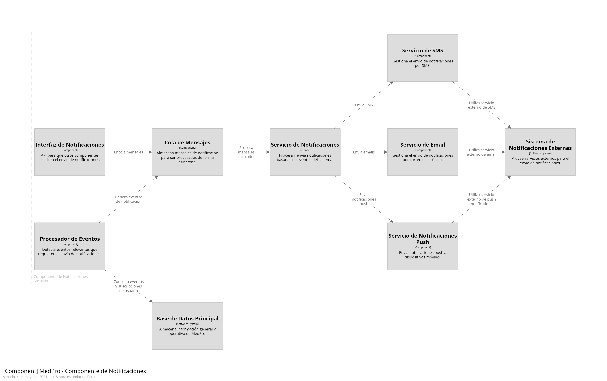
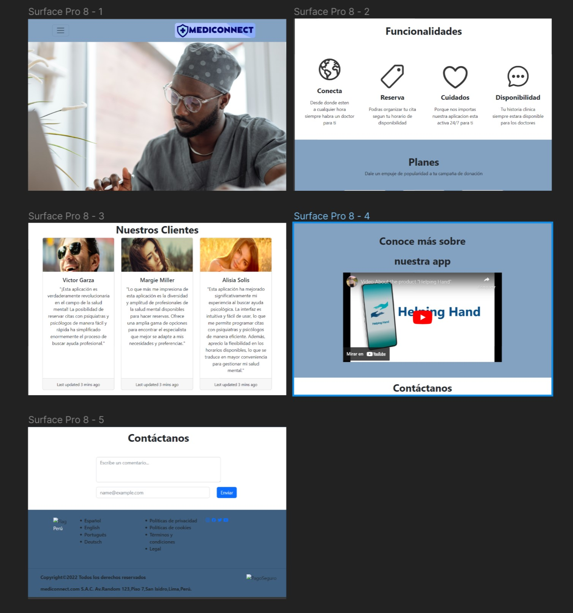

# MediConnect-Report
  

**Universidad:** Universidad Peruana de Ciencias Aplicadas

**Carrera:** Ingeniería de Software

**Nombre del Curso:** Arquitectura de Software Emergentes

**Sección:** WX82

**Nombre del Profesor:** Christian Luis de los Rios Fernandez

**"Informe del Trabajo Final"**

**Nombre de la startup:** "MediConnect"

**Nombre del Producto:** "MedPro"

**Relacion de Integrantes:**
  - Gabriela Soledad Nomberto Ramos (U202113876)
  - Dennis Piero Quevedo Yucra (U201619823)
  - Diego Enrique Osorio Horna (U201913822)
  - Andrea Sofia Alfaro Salinas (U202115862)

**Mes y Año:** Mayo 2024

**Ciclo:** 2024-1   

# Registro de Versiones del Informe

| Version | Fecha | Autor | Descripcion de la Modificación  | 
|---------- | ----- |------ | ----------------| 
| 1.0  | 9/04/2024 | Gabriela Nomberto | Estructuracion del archivo en un repositorio |
| 1.1  | 10/04/2024 | Gabriela Nomberto | Creacion de ramas por capitulos | 
| 1.2  | 11/04/2024 | Dennis Quevedo | Completar contenido ya tenido en todos los capítulos |
| 1.3  | 12/04/2024 | Todos los participantes | Completar contenido que se tenia que modificar, además de finalizar otros nuevos puntos |
| 1.4  | 13/04/2024 | Todos los participantes | Mejora continua del trabajo antes de poder enviar | 
| 2.0  | 29/04/2024 | Andrea Alfaro | Corrección y revisión del capítulo I, II y III | 
| 2.1  | 30/04/2024 | Andrea Alfaro | Corrección y revisión del capítulo IV | 
| 2.2  | 01/05/2024 | Andrea Alfaro | Elaboración del capítulo V | 
| 2.3  | 02/05/2024 | Andrea Alfaro | Elaboración del capítulo VI | 

## Project Report Collaboration Insights 
**Enlace del Project Report:** [https://github.com/MediConnect-Arq/MediConnect-Report/tree/main] 

## Contenido 

### [Tabla de Contenidos](#tabla-de-contenidos)

### Student Outcome

### Capítulo I: Introducción
  - #### 1.1. Startup Profile
    - 1.1.1. Descripción de la Startup
    - 1.1.2. Perfiles de Integrantes del equipo
  - #### 1.2. Solution Profile
    - 1.2.1. Antecedentes y problemática
    - 1.2.2. Lean UX Process
      - 1.2.2.1 Lean UX Problem Statements
      - 1.2.2.2 Lean UX Assumptions
      - 1.2.2.3 Lean UX Hypothesis Statements
      - 1.2.2.4 Lean UX Canvas
  - #### 1.3. Segmentos Objetivos

### Capítulo II: Requirements Elicitation & Analysis
  - #### 2.1. Competidores
    - 2.1.1. Análisis competitivo
    - 2.1.2. Estrategias y tácticas frente a competidores
  - #### 2.2. Entrevistas
    - 2.2.1. Diseño de entrevistas
    - 2.2.2. Registro de entrevistas
    - 2.2.3. Análisis de entrevistas
  - #### 2.3. Needfinding
    - 2.3.1. User Personas
    - 2.3.2. User Task Matrix
    - 2.3.3. Empathy Mapping
    - 2.3.4. As-is Scenario Mapping
  - #### 2.4. Ubiquitous Language

### Capítulo III: Requirements Specification
  - #### 3.1. To-Be Scenario Mapping
  - #### 3.2. User Stories
  - #### 3.3. Impact Mapping
  - #### 3.4. Product Backlog

### Capítulo IV: Strategic-Level Software Design
  - #### 4.1. Strategic-Level Attribute-Driven Design
    - 4.1.1. Design Purpose
    - 4.1.2. Attribute-Driven Design Inputs
      - 4.1.2.1. Primary Functionality (Primary User Stories)
      - 4.1.2.2. Quality attribute Scenarios
      - 4.1.2.3. Constraints
    - 4.1.3. Architectural Drivers Backlog
    - 4.1.4. Architectural Design Decisions
    - 4.1.5. Quality Attribute Scenario Refinements
  - #### 4.2. Strategic-Level Domain-Driven Design
    - 4.2.1. EventStorming
    - 4.2.2. Candidate Context Discovery
    - 4.2.3. Domain Message Flows Modeling
    - 4.2.4. Bounded Context Canvases
    - 4.2.5. Context Mapping
  - #### 4.3. Software Architecture
    - 4.3.1. Software Architecture System Landscape Diagram
    - 4.3.2. Software Architecture Context Level Diagrams
    - 4.3.3. Software Architecture Container Level Diagrams
    - 4.3.4. Software Architecture Deployment Diagrams

### Capítulo V: Tactical-Level Software Design.
- #### 5.X. Bounded Context: <Bounded Context Name>
  - 5.X.1. Domain Layer.
  - 5.X.2. Interface Layer.
  - 5.X.3. Application Layer.
  - 5.X.4. Infrastructure Layer.
  - 5.X.6. Bounded Context Software Architecture Component Level Diagrams.
  - 5.X.7. Bounded Context Software Architecture Code Level Diagrams.
      - 5.X.7.1. Bounded Context Domain Layer Class Diagrams.
      - 5.X.7.2. Bounded Context Database Design Diagram.

### Capítulo VI: Solution UX Design.
- #### 6.1. Style Guidelines.
  - 6.1.1. General Style Guidelines.
  - 6.1.2. Web, Mobile & Devices Style Guidelines.
- #### 6.2. Information Architecture.
  - 6.2.2. Labeling Systems.
  - 6.2.3. Searching Systems.
  - 6.2.4. SEO Tags and Meta Tags.
  - 6.2.5. Navigation Systems.
- #### 6.3. Landing Page UI Design.
  - 6.3.1. Landing Page Wireframe.
  - 6.3.2. Landing Page Mock-up.
- #### 6.4. Applications UX/UI Design.
  - 6.4.1. Applications Wireframes.
  - 6.4.2. Applications Wireflow Diagrams.

### Conclusiones 
  - #### Conclusiones y Recomendaciones
  - #### Video About-the-Team
  
### Bibliografía

### Anexos

  
# Student Outcome

| Criterio Especíico | Acciones Realizadas | Conclusiones|
| ------------------ | ------------------- | ----------- |
| Comunica oralmente sus ideas y/o resultados con objetividad a público de diferentes especialidades y niveles jerárquicos, en el marco del desarrollo de un proyecto en ingeniería | **TB1** <br/> Andrea Alfaro <br/> Colaboré activamente en reuniones donde se discutían aspectos técnicos y estratégicos del proyecto con profesionales de diversas áreas de especialización <br/><br/> Gabriela Nomberto <br/> Participe y dividí las partes para que cada uno de los integrantes del grupo dando plazos y mejorando la comunicacion <br/><br/> Dennis Quevedo <br/> Realicé y agendé las reuniones así como aplicar mejoras al trabajo para que tenga el alcance del curso <br/><br/> Diego Osorio <br/> Participé en las reuniones para las mejoras y para consultar y mejorar las partes repartidas para cada uno <br> **TP** <br> Andrea Alfaro <br> Colaboré activamente en el avance del trabajo y expuse los resultados del avance de nuestra solución. | Concluimos que las reuniones y las mejoras continuas entre todos nos ayuda a mejorar el reporte de trabajo y poder colaborar todo de forma equitativa | 
| Comunica en forma escrita ideas y/o resultados con objetividad a público de diferentes especialidades y niveles jerárquicos, en el marco del desarrollo de un proyecto en ingeniería. | **TB1** <br/> Andrea Alfaro <br/> Participé en la revisión y edición de documentos técnicos escritos por otros miembros del equipo, brindando retroalimentación constructiva para mejorar la claridad y objetividad de la comunicación escrita. <br/><br/> Gabriela Nomberto <br> Participé en la construccion de las arquitecturas de la aplicacion web, asi como el desarrollo del reporte en R Markdown <br/><br/> Dennis Quevedo <br/> Realicé mejoras en los capítulos 1, 2 y 3 para que cumpla con el alcance del curso <br/><br/> Diego Osorio <br/> Realicé tecnicas y clasificacion para obtener una mejor vision del startup presentado<br> **TP** <br> Andrea Alfaro <br> Realicé la corrección y avances solicitados para la entrega y el análisis de Tactical-Level Software Design| Para este apartado, todos aportamos en la estructuracion y llenado del reporte, trabajando asi en grupo y entendiendonos  entre todos | 

# Capítulo I: Introducción

## 1.1. Startup Profile

### 1.1.1. Descripción de la Startup

Nuestro equipo ha observado un alarmante aumento en los problemas de salud mental entre los jóvenes en los últimos años en nuestro país. Es frecuente encontrar a personas de entre 18 y 30 años lidiando con sentimientos de frustración en diversas áreas de sus vidas, como trabajo, estudios, familia y finanzas, entre otros. Lamentablemente, muchos de estos casos no reciben la atención necesaria para abordar adecuadamente su salud mental. Motivados por esta situación, hemos decidido unirnos para crear una solución de software que pueda contribuir a aliviar y reducir estos problemas emocionales. Así nació MediConnect, nuestra startup dedicada a conectar a profesionales de la salud mental con aquellas personas que necesiten apoyo y orientación para enfrentar los desafíos de la vida diaria.

**Misión:** Nuestra misión en MediConnect es proporcionar acceso fácil y seguro a servicios de salud mental de alta calidad, conectando a profesionales capacitados con aquellos que necesitan apoyo para superar los desafíos de la vida diaria. Nos comprometemos a liderar la innovación en el campo de la salud mental y promover el bienestar emocional y psicológico de individuos de todas las edades.

**Visión:** En MediConnect, visualizamos un mundo donde la salud mental sea una prioridad global. Nos esforzamos por crear una sociedad donde todas las personas tengan acceso a los recursos necesarios para cuidar su salud emocional y vivir una vida plena y satisfactoria. A través de nuestra plataforma MedPro, aspiramos a ofrecer ayuda, esperanza y un camino hacia una vida más saludable y feliz para todos.

### 1.1.2. Perfiles de integrantes del equipo

| Nombre | Descripción | Foto |
| ----- | ------- |  ----  |    
| Gabriela Nomberto Ramos | Soy Gabriela Nomberto, pertenezco a la carrera de Ingeniería de Software en el 8vo ciclo de esta.<br/> Tengo experiencia amplia en diversos lenguajes de programación, así como el uso de servidores cloud, soy muy organizada, responsable y sobre todo puntual. Soy bailarina de caporales en una agrupación externa a la universidad. Todo ello me enseñó a como trabajar en equipo, apoyar e investigar temas que me emocionan como lo es ciberseguridad y bases de datos, mis mejores habilidades es la comunicación en grupo y solucionar problemas bajo presión. |  |
| Dennis Quevedo Yucra    | Soy Dennis Piero Quevedo, estudiante de la carrera de Ingeniería de Software y estoy cursando el 8vo ciclo. Tengo conocimientos de múltiples lenguajes de programación. Así mismo, me encuentro realizando mis prácticas pre-profesionales aplicando todos los conocimientos adquiridos a lo largo de la carrera. Me considero una persona responsable y sobre todo puntual. Por otro lado, soy ciclista aficionado, me gusta mucho aprender por cuenta propia y una de mis mejores habilidades es solucionar los problemas a la brevedad posible |  |
| Diego Osorio Horna      | Soy un estudiante de la carrera de Software de la UPC en Monterrico, actualmente estoy cursando el 8vo ciclo. Mi afición es la programación de aplicaciones web front-end y lenguaje favorito es JavaScript |  | 
| Andrea Alfaro Salinas   | Mi nombre es Andrea Alfaro, estudiante de la carrera de Ingeniería de Software. Mi motivación radica en enfrentar desafíos que requieran soluciones creativas e innovadoras. A lo largo de mi carrera, he demostrado ser proactiva y colaborativa, comprometida con el éxito de cada proyecto. Mi enfoque se centra en un aprendizaje constante y la mejora continua de mis habilidades de programación, explorando siempre nuevas herramientas y tecnologías |  | 


## 1.2. Solution Profile

Desarrollaremos MedPro, una aplicación web líder en el mercado que revolucionará la forma en que se aborda la salud mental. MedPro permitirá a los usuarios acceder fácilmente a una amplia red de profesionales de la salud mental altamente calificados, eliminando las barreras tradicionales y proporcionando una plataforma segura y confiable para recibir apoyo emocional y psicológico. Además de facilitar la conexión entre profesionales y pacientes, MedPro ofrecerá una línea de emergencia disponible las 24 horas del día, los 7 días de la semana, para brindar ayuda inmediata en momentos de crisis. Con MedPro, estamos comprometidos a proporcionar una solución completa y efectiva para promover la salud mental y el bienestar emocional en nuestra comunidad.

### 1.2.1. Antecedentes y Problemática

Para esta parte haremos uso de la técnica de 5W’s y 2H’s para resaltar la problemática y poder solucionarlo.

  - **Who?**
  
    En principio, están involucrados en esta problemática un buen porcentaje de los jóvenes de 18 a 30 años pertenecientes a la cuidad de Lima, Perú. Quienes pasan por diversos problemas de tensión laboral, educativa, familiar, económica, etc.

  - **What?**

    La problemática que nosotros estamos enfrentando con nuestra solución es el alto índice del mal estado de la salud mental que se encuentra presente en gran cantidad de la población joven de 18 a 30 años de la ciudad de Lima, Perú. Este problema evidencia que la salud mental en nuestro país no es tomada en cuenta por el valor que tiene. Asimismo, la dificultad que existe para aliviar estos comportamientos son en su mayoría muy difíciles ya que los jóvenes le dedican un tiempo mínimo a su estabilidad emocional, evidenciando un aumento desmedido de cuadros de estrés, que en muchos casos suelen llegar a situaciones de ansiedad, depresión y problemas de aprendizaje en la población limeña.
    
  - **When?**
  
    Este problema es de hace bastante tiempo atrás, pero se ha hecho notar más a partir de los años 2000 en adelante. En la actualidad, los casos suelen suscitarse mucho más y evidencia que la mayoría de los jóvenes pueden pasar por cuadros de estrés, frustración o ataques en cualquier hora del día, dependerá mucho de la persona, de su entorno y de los problemas que este pasando.

  - **Why?**
  
    Sabemos que a raíz de la pandemia se vio una deficiencia notoria en los sistemas de los centros de salud y se debe mejorar para no presentar errores que puedan afectar a los pacientes, médicos y el mismo centro de salud.

  - **Where?**

    Los problemas de salud mental suelen presentarse en cualquier lugar. En la etapa de la juventud, los problemas se pueden presentar en lugares concurridos donde uno puede socializar, como en la universidad, trabajo, hasta en el mismo hogar. Este problema no depende tanto del lugar donde se encuentre sino de las circunstancias en cómo suceden.

  - **How?**
  
    Lo que llevó a estos jóvenes a llegar a esta situación son los diversos factores familiares, sociales, académicos que están pasando. Muchos de ellos, lo toman como problemas sin solución lo que causa frustración en ellos. Además, al no tomar en cuenta el valor que tiene su salud mental suelen dejar pasar esta sensación de estrés y evitan programar una cita con un psicólogo por falta de disponibilidad. Ante ello, los cuadros de frustración y problemas sin precedentes van en aumento llegando así a un punto grave.

  - **How Much?**
  
    Según fuentes confiables, a lo largo de este tiempo se ha evidenciado en los jóvenes que el problema de la falta de salud mental es un problema grave, confirmando según lo siguiente:
    - Según la Asociación Americana de Psicología, el 39% de las personas entre 18 y 33 años se declaran estresados. El estrés que sufren los jóvenes los hace más propensos a cuadros de irritabilidad y a sufrir de ansiedad o depresión.
    - Según el Consejo General de la Psicología, el 80% de jóvenes con trastornos de estrés y ansiedad no reciben ningún tratamiento o no buscan ayuda a profesionales expertos en la salud mental.
    - Según la Unicef, más del 20% de los jóvenes de todo el mundo sufren trastornos mentales.
    - Para entender la importancia de poner atención en estos tipos de problemas, según la OMS, el hecho de no ocuparse de los trastornos de salud mental de los jóvenes tiene consecuencias que se extienden a la edad adulta, perjudican la salud física y mental de la persona y restringen sus posibilidades de llevar una vida plena en el futuro.
    - De acuerdo con el Instituto Nacional de la Salud, cerca de 1 de cada 3 jóvenes entre las edades de 18 años puede tener un trastorno de ansiedad y estrés. El número va en aumento; entre el 2007 y el 2012, los trastornos de ansiedad en los jóvenes aumentaron un 20 %.
    - Hoy en día, se sabe que el Colegio de Psicólogos y las facultades luchan para mantener a flote la importancia de la salud mental, así como erradicar a los llamados “falsos psicólogos” que existen en Lima Perú. Asimismo, buscan que haya una mejor expansión y concientización sobre la salud mental hacia las personas. 

### 1.2.2. Lean UX Process

#### 1.2.2.1. Lean UX Problem Statements

- **Problem Statement 01**:

  Al enfrentarse a problemas en los sistemas informáticos y fallos en el registro de pacientes, los centros de salud luchan por brindar una atención eficiente y de calidad. Este desafío resulta en experiencias deficientes para los pacientes, demoras en la atención y una falta de fiabilidad en el sistema.

  ¿Cómo podemos optimizar los procesos de atención al cliente en los centros de salud para garantizar una experiencia sin demoras y con un sistema fiable?

- **Problem Statement 02**:

  La falta de información clara sobre qué especialidad médica buscar y los obstáculos en la programación de citas contribuyen a la pérdida de tiempo y frustración para los pacientes. Esta situación afecta negativamente la experiencia del paciente y puede llevar a una atención médica ineficaz.

  ¿Cómo podemos facilitar a los pacientes la identificación de la especialidad médica adecuada y agilizar el proceso de programación de citas para optimizar su tiempo y mejorar su experiencia en los centros de salud?

- **Problem Statement 03**:

  La deficiente atención al cliente, las demoras en la atención y los problemas de rendimiento del sistema son desafíos comunes enfrentados por los centros de salud debido a fallos en el sistema y errores en el registro de datos. Estos problemas afectan tanto a los pacientes como al personal médico y contribuyen a una experiencia de atención insatisfactoria.

  ¿Cómo podemos disminuir la deficiente atención al cliente, evitar las demoras en la atención y mejorar el rendimiento del sistema en los centros de salud?

- **Problem Statement 04**:

  Identificamos que al momento de los registros de los pacientes o médicos existe una dificultad y no se almacena correspondientemente los datos ingresados tanto por los pacientes como los médicos, además los pacientes no pueden visualizar su historial médico y tener más a detalle su salud física.

  ¿Cómo podemos mejorar estos registros y se guarden de manera segura y satisfactoriamente para evitar problemas futuros a los pacientes, médicos y establecimientos de salud?

- **Problem Statement 05**:

  La falta de recursos para proporcionar orientación y apoyo psicológico a los pacientes de manera oportuna y efectiva es un desafío común en muchos centros de salud. La ausencia de personal capacitado y la carga de trabajo existente pueden dificultar la atención adecuada a las necesidades emocionales de los pacientes.

  ¿Cómo podemos implementar un chatbot predictivo en los centros de salud para proporcionar orientación y apoyo psicológico a los pacientes de manera eficiente y oportuna, mejorando así su experiencia de atención médica y reduciendo la carga sobre el personal médico?

#### 1.2.2.2. Lean UX Assumptions 

**Business Outcomes**

- Lograr ser reconocidos por los centros de salud como una aplicación principal para poder manejar la gestión y registro entre pacientes y médicos de la salud.
  - *Métrica:* Número de centros de salud que adoptan MediConnect como su principal solución de gestión.
  
- Lograr que los establecimientos de salud que nos contraten sientan una satisfacción mayor las 80% en el uso de la aplicación y sientan la confiabilidad que contiene.
   - *Métrica:* Porcentaje de satisfacción del cliente en encuestas posteriores al uso de la aplicación.

- Lograr que el más 90% de las personas que utilicen nuestra aplicación logren entenderla y sea intuitivo para ellos mismos.
   - *Métrica:* Porcentaje de usuarios que completan una tarea clave en la aplicación sin necesidad de asistencia o soporte.
     
- Ser reconocidos entre nuestros segmentos objetivos como una aplicación confiable y segura para mantener sus datos personales asi como médicos para que puedan llevar su propio seguimiento.
   - *Métrica:* Número de usuarios que confían en la seguridad de la aplicación para almacenar su información personal y médica.

**Users** 

Nuestros usuarios están categorizados en 2 grupos

- *Médicos de la salud mental:* Priorizan un sistema donde les permita registrar y gestionar de mejor forma para brindar una atención de calidad.

- *Pacientes:* Interesados en una aplicación web que busquen saber de forma precisa el historial médico brindado por los médicos asi como la reserva de sus citas médicas y/o tratamientos.

**User Outcomes Médico del centro de salud:**

- Esperan acceder a un sistema que les ayude a registrar de manera adecuada el análisis médico dado a los pacientes sin problema alguno. Buscan una navegación sencilla e intuitiva en nuestra aplicación para que puedan gestionar de manera precisa los tratamientos en los pacientes que lo necesitan.
   - *Métrica:* Tiempo promedio dedicado por médico al registro y gestión de tratamientos.
  
- Poder ser capaces de hacer modificaciones a lo largo de los tratamientos de los pacientes y poder gestionarlo de manera rápida y segura al registrar datos personales.
   - *Métrica:* Porcentaje de tratamientos que se modifican o actualizan en un período de tiempo determinado.

**Paciente y/o usuario que se registre por primera vez en un centro de salud**

- Busca lograr registrar sus datos personales satisfactoriamente en la aplicación web realizada
    - *Métrica:* Porcentaje de usuarios que completan el registro en la aplicación.
      
- Lograr ver su historial médico actualizado para que este en constante precaución y este al tanto de lo que pueda o ha acontecido
    - *Métrica:* Frecuencia de acceso al historial médico por parte de los usuarios.
      
- Conseguir seguridad al utilizar una pagina web de manera segura al momento de registrarse y no se arriesgue en que puedan perderse datos importantes
   - *Métrica:* Nivel de confianza del usuario en la seguridad de la aplicación.

**Features**

- Los usuarios médicos y pacientes podrán visualizar, editar o modificar el registro hecho por ellos mismos
 
- Los usuarios médicos podrán visualizar resultados, prescripciones, medicamentos y registrarlos adecuadamente

- Los usuarios pacientes podrán gestionar su historial médico, así como filtrar las fechas que busquen visualizar
  
- Los usuarios médicos podrán gestionar y filtrar según criterio propio para saber el avance de sus pacientes y poder actuar con antelación al caso si es necesario con urgencias.


#### 1.2.2.3. Lean UX Hypothesis Statements

- **Hypothesis Statement 01**:

  Creemos que al ofrecer una aplicación web que permita a los médicos y pacientes registrar, gestionar y modificar adecuadamente las citas y/o tratamientos, tendremos una mejora amplia de centros de salud contratándonos para la implementación de nuestra aplicación web además de que ofrecemos seguridad y constante modificación por si suceden fallos en el sistema.

  Sabremos que hemos tenido éxito.

  Cuando hayamos conseguido una adopción del 80% de los centros de salud en nuestra área de mercado objetivo
  
- **Hypothesis Statement 02**:
  
  Creemos que al poder ofrecer nuestra aplicación web, los pacientes o usuarios que por primera vez lleguen a atenderse en su salud mental sabrán que sus datos personales asi como los datos detallados de las citas, tratamientos y medicamentos están registrados cuidadosamente y con seguridad. Asimismo, se harán pruebas de manera que podamos mantener la eficiencia y seguridad del sistema.

  Sabremos que hemos tenido éxito.

  Cuando el 90% de los pacientes que utilicen nuestra aplicación informen una satisfacción del 90% o más en términos de seguridad y facilidad de uso.
  
- **Hypothesis Statement 03**:
  
  Creemos que al diseñar una interfaz de usuario intuitiva y de fácil uso permita a los usuarios gestionar de manera rápida la acción que deba realizar, además de que, al ser de fácil uso y manejo, los usuarios podrán dirigirse a los apartados de manera sencilla y sin ningún problema alguno.

  Sabremos que hemos tenido éxito.

  Cuando el 95% de los usuarios encuentren la interfaz de usuario fácil de usar y satisfactoria en términos de navegación y acceso a funciones.
  
- **Hypothesis Statement 04**:
  
  Creemos que al implementar una aplicación web que facilite la interacción entre médicos y pacientes, agilizando el proceso de registro y gestión de citas y tratamientos, conseguiremos una adopción más amplia por parte de los centros de salud.

  Sabremos que hemos tenido éxito.

  Cuando logremos una adopción del 70% entre los médicos de salud mental y los pacientes que utilizan nuestra plataforma para la gestión de citas y tratamientos.
  
- **Hypothesis Statement 05**:

  Creemos que al ofrecer una solución tecnológica que garantice la seguridad y privacidad de los datos médicos y personales de los pacientes, aumentaremos la confianza de estos en nuestra aplicación.

  Sabremos que hemos tenido éxito.

  Cuando el 80% de los pacientes que utilicen nuestra aplicación informen una mejora en su confianza en la seguridad y privacidad de sus datos médicos y personales.

#### 1.2.2.4. Lean UX Canvas

| Business Problem | Solutions | Business Outcomes |
| --- | --- | --- |
| Los centros de salud enfrentan dificultades para brindar una atención eficiente y de calidad debido a problemas en los sistemas informáticos y fallos en el registro de pacientes. ¿Cómo podemos optimizar los procesos de atención al cliente en los centros de salud para garantizar una experiencia sin demoras y con un sistema fiable? <br/> <br/> Muchos pacientes experimentan pérdida de tiempo y frustración al no saber a qué especialidad médica acudir para abordar sus problemas de salud de manera efectiva. ¿Cómo podemos facilitar a los pacientes la identificación de la especialidad médica adecuada y agilizar el proceso de programación de citas para optimizar su tiempo y mejorar su experiencia en los centros de salud? | Los pacientes usuarios podrán gestionar su historial médico, así como filtrar las fechas que busquen visualizar <br/> <br/> Contener una base de datos segura y actualizada Brindar un seguimiento actualizado entre los médicos y los pacientes para un mejor tratamiento. <br/> <br/>   Implementar un chatbot de consulta para ahorrar el tiempo de espera de los pacientes. | Aumento del 70% en la eficiencia administrativa de los centros de salud. <br/> <br/> Reducción del 30% en los costos operativos.<br/> <br/> Aumento del 15% en la rentabilidad mediante la oferta de servicios premium <br/> <br/> Incremento del 20% en la satisfacción del cliente y fidelidad del 10% hacia los centros de salud. |

| Users |  | Users Outcomes & Benefits |
| --- | --- | --- | 
| Profesionales de la salud mental:<br/>Personas con estudios en medicina que laboran en un centro de atención médica. <br/> <br/> Pacientes: <br/>Personas que necesitan atención médica. | | Reducción del tiempo de espera para que los atiendan. <br/><br/> Mayor seguridad y confianza al acudir a un centro médico. <br/><br/> Acceso a información actualizada sobre los pacientes.<br/><br/> Facilidad para saber a qué especialidad acudir mediante el chatbot. |

| Hypotheses | What is the most important thing we need to learn first? | What’s the least amount of work we need to do to learn the next most important thing? |
| --- | --- | --- |
| Creemos que al ofrecer una aplicación web que permita a los médicos y pacientes registrar, gestionar y modificar adecuadamente las citas y/o tratamientos, tendremos una mejora amplia de centros de salud contratándonos para la implementación de nuestra aplicación web además de que ofrecemos seguridad y constante modificación por si suceden fallos en el sistema. <br/><br/> Creemos que al poder ofrecer nuestra aplicación web, los pacientes o usuarios que por primera vez lleguen a atenderse en su salud mental sabrán que sus datos personales, así como los datos detallados de las citas, tratamientos y medicamentos están registrados cuidadosamente y con seguridad. Asimismo, se harán pruebas de manera que podamos mantener la eficiencia y seguridad del sistema. <br/><br/> Creemos que al diseñar una interfaz de usuario intuitiva y de fácil uso permita a los usuarios gestionar de manera rápida la acción que deba realizar, además de que, al ser de fácil uso y manejo, los usuarios podrán dirigirse a los apartados de manera sencilla y sin ningún problema alguno. <br/><br/> Creemos que al implementar una aplicación web que facilite la interacción entre médicos y pacientes, agilizando el proceso de registro y gestión de citas y tratamientos, conseguiremos una adopción más amplia por parte de los centros de salud. <br/><br/> Creemos que al ofrecer una solución tecnológica que garantice la seguridad y privacidad de los datos médicos y personales de los pacientes, aumentaremos la confianza de estos en nuestra aplicación. | La aceptación del mercado hacia la nueva aplicación web para optimizar los procesos de atención en centros de salud. <br/><br/> Las principales necesidades y preferencias de los usuarios de centros de salud en Lima. <br/><br/> La disposición de los médicos para adoptar nuevas herramientas de monitoreo y mejorar la atención a sus pacientes. <br/><br/> La viabilidad de implementar un servicio premium y la disposición de los usuarios a pagar por características adicionales. <br/><br/> La eficacia de la aplicación web en mejorar la experiencia general del usuario de centros de salud. | Realizar encuestas rápidas a pacientes y médicos para evaluar su disposición a utilizar una nueva aplicación web. <br/><br/> Organizar grupos focales con pacientes para discutir la implementación de la herramienta de chatbot. <br/><br/> Lanzar una versión piloto de la aplicación web con funcionalidades básicas para recopilar comentarios de los usuarios sobre su utilidad y usabilidad. <br/><br/> Realizar análisis de mercado para identificar la demanda potencial de un servicio premium y evaluar la disposición de los usuarios a pagar por características adicionales. <br/><br/> Observar el comportamiento de los usuarios de clínicas y hospitales en cuanto a su interacción con las aplicaciones web existentes y analizar las áreas de mejora identificadas. | 


## 1.3. Segmentos Objetivos

Identificamos dos segmentos objetivos claves para este startup que son los médicos que necesitan registrar de forma segura los tratamientos y/o citas; y los pacientes que necesitan saber que sus reservas, datos personales, historial médico, etc. se encuentren seguros y lo puedan visualizar de una forma sencilla. 


**Especialistas de la salud mental**

Nos dirigimos a este segmento dado que requieren una solución segura y de confianza que les ayude a gestionar y registrar de manera segura los tratamientos, citas y algún aspecto clínico extra de los pacientes que atiendan y quieran sus servicios. 

**Paciente:**

Para nosotros este es otro segmento fundamental dado que representan a las personas que buscan una atención médica de salud mental de calidad asi como de administrar y acceder a su información medica como lo es su historial de manera segura y sencilla.

# Capítulo II: Requirements Elicitation & Analysis

## 2.1. Competidores

### 2.1.1. Análisis Competitivo

**Perfil del Startup**
| Startup | MedPro | Calm | Wysa | Simple Habit |
| ------- | ------ | ---- | ---- | -------------|
| Logo    |  |  |  |  |
| Overview | Nuestra StarpUp ayuda al sector médico a encontrar nuevas soluciones digitales. Dentro de la gestión del rubro como dentro de la propia medicina | Calm es una aplicación móvil y web que se dedica a disminuir los niveles de estrés de sus usuarios mediante la meditación con sonidos especiales. | Wysa es un aplicativo móvil que apoya a sus usuarios a que puedan gestionar sus factores estresantes por medio de una I.A y un chatbot que permite calmar su ansiedad. | Simple Habit es una aplicación de meditación en pequeñas capsulas guiadas y presentan videos que facilitan a los usuarios a conciliar el sueño en un día ajetreado. |
| Ventaja Competitiva <br/> ¿Qué valor ofrece a los clientes? | Nuestra StarpUp ayuda al sector médico a encontrar nuevas soluciones digitales. Dentro de la gestión del rubro como dentro de la propia medicina | Es un aplicativo que aparte de instalarse en dispositivos móviles también es para uso con el computador. Además, ofrece una serie de sonidos para la meditación y relajación auditiva. | Chat-Bot especializado en varias áreas de la salud mental, lo cual permite desestresarse de diferentes maneras. Se caracteriza por ser una app anónima y realiza sus actividades manteniendo privada los datos del usuario. | App móvil que permite aliviar los cuadros de estrés en 5 minutos todos los días |

**Perfil de Marketing**
| Startup | MedPro | Calm | Wysa | Simple Habit |
| ------- | ------ | ---- | ---- | -------------|
| Mercado Objetivo | Mayores de 15 años que presentan problemas de estrés. | Mayores de 10 años que presenten cuadros de estrés. | El uso es para mayores de 18 años, entre usuarios normales y trabajadores. | Para todo público que desee desestresarse. | 
| Estrategias de Marketing | Influencia por redes sociales como Instagram, Facebook, Twitter. | Influencia por redes sociales como Instagram, Facebook, Twitter. | Influencia por redes sociales Instagram, YouTube y Facebook. | Influencia por redes sociales (Facebook y YouTube) ofreciendo la app de manera gratuita totalmente. | 


**Perfil de Producto**
| Startup | MedPro | Calm | Wysa | Simple Habit |
| ------- | ------ | ---- | ---- | -------------|
| Productos & Servicios | Conexión con médicos especialistas en problemas de depresión, ansiedad y estrés. | Espacios virtuales que ayudan a aliviar el estrés a través de la meditación en tan solo 5 minutos | Espacios virtuales que ayudan a aliviar la frustración a través de consejos de profesionales. Asimismo, ofrecen el servicio de supervisión por medio de I.A. |  Espacios virtuales que ayudan a aliviar el estrés y ansiedad con la meditación.|
| Precios y Costos | Suscripción mensual dentro de la aplicación. | Planes anuales y de por vida, con 40% de descuento de 69.99 US$ USD | Planes gratuitos, diarios y anuales. con costos de $29,99 y $68,99 respectivamente. | Planes anuales por $49.99 y sea personales, familiar o para empresas. | 
| Canales de distribución (Web y/o Móvil) |   Web y Móvil | Web y Móvil | Móvil | Móvil | 

**Análisis SWOT**
| Startup | MedPro | Calm | Wysa | Simple Habit |
| ------- | ------ | ---- | ---- | -------------|
| Fortaleza | -Iniciación gratuita <br/> -Múltiples planes asequibles <br/> -Médicos muy profesionales y reconocidos | -Instalación gratuita <br/> -Ofrece múltiples herramientas para tener un mejor tiempo de sueño <br/> -El tiempo de alivio del estrés es de solo 5 minutos. | -Instalación gratuita <br/> -La aplicación puede ser utilizada a cualquier hora del día <br/> -Cuenta con especialistas que brindan conferencias internacionales para conocer más acerca de la salud mental | -Instalación gratuita <br/> -Puede ser descargado en móviles Android o IOS | 
| Debilidades | -Poca popularidad acerca de la aplicación | El tiempo de las sesiones gratuitas son muy limitadas | Los profesionales no están conectados al 100% durante las noches y la respuesta es muy tardía. | La aplicación está todo en inglés y no facilita su uso. | 
| Oportunidades | Importancia en la salud mental en los últimos años por parte de los jóvenes | Aumento del índice de estrés en la sociedad durante los últimos años |  Aumento del índice de estrés en los jóvenes a partir de la pandemia del Coronavirus <br/> Se necesita que las personas conozcan más sobre su salud mental | Aumento del índice de estrés en la población mundial a partir de la pandemia del Coronavirus | 
| Amenazas | La competencia empresarial está constantemente innovando. | Existe diversos competidores con la misma idea de negocio ya que no usan nuevas tecnologías | La competencia empresarial está constantemente innovando | Existe un alto índice de personas hispanohablante que tienen estrés, pero no cuentan con conocimientos del idioma inglés. | 

### 2.1.2. Estrategias y tácticas frente a competidores

- Identificar el entorno que nos rodea en este caso identificar los competidores que tenemos que brindan el mismo servicio que nosotros en este caso un sistema que une pacientes con medicos de la salud mental, además de preveer un chatbot con un pre diagnostico definido.
     
- Crear un cuadro para ver que estrategias utilizan cada una de ellas que es lo que ofrecen para diferenciarse cada una de ellas y también nuestro sistema web
     
- Nosotros ofreceremos una prueba gratis de un mes para que prueben nuestro sistema.
     
- Como táctica utilizaremos la penetración de mercado, lo cual consiste en promover en todas las redes sociales sobre nuestro sistema de control y atencion al cliente ofreciendo un programa de fidelidad.

## 2.2. Entrevistas 

### 2.2.1. Diseño de Entrevistas

- Al comienzo de la entrevista
    - Al empezar la entrevista, nos presentaremos de manera correcta utilizando un lenguaje amical y breve para no perjudicar la comunicación con el usuario.
    - Deberemos solicitar la aprobación del usuario con la entrevista, mencionándole que lo sucedido en la entrevista será para recopilación de datos para uso académico y confidencial.
  
- Durante la entrevista
    - Se respetará la decisión del entrevistado si no quiere responder alguna pregunta para mantener el clima agradable y pueda expresarse de mejor forma sus opiniones.
    - Como entrevistador, debemos recaudar toda la información necesaria para poder lograr el objetivo del trabajo presente, debemos dirigir la entrevista por si llega haber una leve desviación del tema.
  
- Después de la entrevista
    - Siendo el entrevistador, debemos agradecer la participación y el tiempo brindado por el entrevistado, asimismo pediremos una conclusión del entrevistado y procederemos a cerrar la entrevista.

- Relación de preguntas (Médicos de la salud mental)
  1. ¿Cuál es su nombre, edad y ocupación?
  2. Usted que trabaja en un centro de salud o de manera independiente, ¿Qué deficiencias ha podido evidenciar al momento de registrar o revisar historiales clínicos?
  3. En algún momento y durante su horario de trabajo, ¿el sistema de registro con el cual trabaja no respondía o presentaba errores?
  4. Con lo dicho, ¿llego a tener problemas con los pacientes debido a los errores del sistema?
  5. Comentándole sobre nuestra aplicación web ¿Le sería de mayor utilidad y tendría la seguridad de usarlo? ¿Le podría ayudar a no cometer errores que en su campo laboral pueda ser básico?
  6. ¿Cuánto estaría dispuesto a pagar por la aplicación dándole mejoras a su atención al cliente? ¿Por qué?
  7. ¿Consideras que nuestro aplicativo podría satisfacer tus necesidades de mejorar tu salud mental? Caso contrario, ¿Qué mejoras le darías a nuestro producto para cumplir con este objetivo? 

- Relación de preguntas (Pacientes y/o personas necesiten ayuda para mejorar su salud mental)
  1. ¿Cuál es su nombre y edad?
  2. ¿Cuánto tiempo dedica en sacar una cita? ¿En algún momento tuvo errores o demoras en el sistema?
  3. ¿Cree que las deficiencias del sistema puedan mejorar y tener un mejor control propio de su avance médico?
  4. ¿De qué forma consideras que tu salud mental ha impactado en tu vida diaria durante los últimos años?
  5. ¿Qué aspectos crees que no se están tomando en cuenta al momento de hablar sobre la salud mental?
  6. ¿Qué esperarías encontrar en una aplicación que se dedique a mejorar la salud mental?
  7. Con lo comentado de nuestra aplicación web, ¿Estaría dispuesto a utilizar la aplicación que le dé una mejor atención y no encuentre errores al momento de registrarse o visualizar sus datos?
  8. ¿Cuánto estaría dispuesto a pagar por la aplicación por una mejor atención, asi como poder visualizar su historial médico?
  9. ¿Consideras que nuestro aplicativo podría satisfacer tus necesidades de mejorar tu salud mental? Caso contrario, ¿Qué mejoras le darías a nuestro producto para cumplir con este objetivo?
 
### 2.2.2. Registro de Entrevistas

**Entrevista N°1**

- **Segmento objetivo:** Especialistas de la salud mental
- **Nombres y apellidos:** Alvaro Garcia Pinto
- **Edad:** 30
- **Ocupación:** Psicólogo

  

- **Enlace del video:** https://www.youtube.com/watch?v=w8fwZyjWcBc&ab_channel=D%C3%A9nnisPieroQuevedo
- **Resumen:** En la entrevista, un profesional de la salud que trabaja en un centro médico expone deficiencias en la gestión de historiales clínicos, resaltando la falta de consistencia y detalles completos. Problemas con sistemas de registro lentos y errores al guardar datos han afectado la eficiencia y la calidad de la atención, generando frustración en los pacientes. El entrevistado ve una oportunidad en una aplicación web que evite errores y aumente la precisión en el registro. Estaría dispuesto a pagar por mejoras que beneficien a los pacientes y reduzcan errores. Además, considera que la aplicación podría contribuir a la salud mental de los pacientes, pero sugiere colaboración con profesionales especializados para lograr un enfoque integral y personalizado.

**Entrevista N°2**

- **Segmento objetivo:** Especialistas de la salud mental
- **Nombres y apellidos:** Antonella Del Carmen
- **Edad:** 
- **Ocupación:** 


- **Enlace del video:** 
- **Resumen:** En esta entrevista, Antonella nos comenta que la aplicación les ayuda como profesionales de la salud a buscar personas que necesiten ayuda o aumentar su campo laboral. Nos comenta que para ella a sido muy difícil la inserción al campo laboral dado que no tiene recomendaciones por el momento pero que poco a poco lo ha ido teniendo.

**Entrevista N°3**

- **Segmento objetivo:** Paciente
- **Nombres y apellidos:** Gabriel Aragón
- **Edad:** 22
- **Ocupación:** Estudiante universitario


- **Enlace del video:** https://www.youtube.com/watch?v=XSzqqVFpn9U&ab_channel=GabrielaNombertoRamos
- **Resumen:** Durante la entrevista, Gabriel nos comenta que la aplicación utilizada tiene y cumple su propósito dado que a medida que busca un profesional para ayudarse puede ver las valoraciones que le dan al médico en cuestión y esto le da cierta confianza para que confíe en nosotros asi como también para que sus datos sean seguros. Nos comenta que las secciones adicionales le ayudarían demasiado, además que al ver su avance personal publicado le dará una cierta motivación para mejorar sesión tras sesión.

**Entrevista N°4**

- **Segmento objetivo:** Paciente
- **Nombres y apellidos:** Fiorella Quevedo Mestanza
- **Edad:** 23
- **Ocupación:** Estudiante universitaria


- **Enlace del video:** https://www.youtube.com/watch?v=Y-awOdihQfY&ab_channel=D%C3%A9nnisPieroQuevedo
- **Resumen:** La entrevistada de 23 años nos comenta que ha llevado sesiones con un coach para poder mejorar en su vida diaria en el entorno laboral y social. Ella cree que la salud mental es importante y que influye bastante en cada acción que realiza e incentiva a los demás a tomar sesiones con un couch o psicólogo para aliviar algún problema que tengan. También, menciona que las gestiones de reservas en las entidades de salud mental tienen problemas al asignar algún especialista y demora mucho el proceso para obtener una cita. Además, considera que la aplicación podría contribuir a la salud mental de los pacientes, pero sugiere colaboración con profesionales especializados para lograr un enfoque integral y personalizado.

**Entrevista N°5**

- **Segmento objetivo:** Paciente
- **Nombres y apellidos:** Renzo Casafranca Carrascal
- **Edad:** 23
- **Ocupación:** Estudiante universitario


- **Enlace del video:** https://drive.google.com/file/d/1csyi7TDGSX8RiheFRhher-0YvZQGoYno/view?usp=sharing
- **Resumen:** Durante la entrevista, Renzo, un paciente preocupado por la gestión de citas médicas, compartió sus experiencias y opiniones sobre el proceso de programación de citas y la atención a la salud mental. Diego expresó frustración por las demoras y errores en el sistema al sacar citas médicas, destacando la necesidad de una mejor gestión y control de su historial médico. Además, señaló el impacto significativo de la salud mental en su vida diaria, resaltando la importancia de abordar adecuadamente estos problemas. Juan mostró interés en encontrar una aplicación que mejore su experiencia, brinde herramientas para gestionar el estrés y ofrezca acceso a profesionales de la salud mental. Estuvo dispuesto a pagar por una aplicación que le brinde una mejor atención y facilidad para acceder a su historial médico, enfatizando la importancia de una solución integral para mejorar su salud mental y bienestar general.


### 2.2.3. Análisis de Entrevistas

En la sección de análisis se identifica con sustento estadístico todas las características objetivas y subjetivas que representan los aspectos más comunes de cada segmento, para sacar las tendencias de los usuarios.

**Segmento pacientes**

- **¿Cuánto tiempo dedica en sacar una cita? ¿En algún momento tuvo errores o demoras en el sistema?:** El 90% de los entrevistados reportaron que dedican más de 10 minutos en sacar una cita, y el 70% indicó haber experimentado errores o demoras en el sistema durante el proceso de reserva de citas.
- **¿Cree que las deficiencias del sistema puedan mejorar y tener un mejor control propio de su avance médico?:** El 85% de los encuestados expresaron que creen que las deficiencias del sistema pueden mejorar significativamente y permitirles tener un mejor control sobre su avance médico.
- **¿Estaría dispuesto a utilizar la aplicación que le dé una mejor atención y no encuentre errores al momento de registrarse o visualizar sus datos?:** El 95% de los participantes manifestaron estar dispuestos a utilizar una aplicación que les brinde una mejor atención y no presente errores al registrarse o visualizar sus datos.

El análisis de las respuestas revela una clara necesidad de mejorar la experiencia de reserva de citas y la eficiencia del sistema utilizado. Aunque la mayoría de los usuarios reportaron dedicar un tiempo considerable en sacar una cita y experimentar errores o demoras en el proceso, existe una percepción positiva sobre la posibilidad de mejoras significativas en el sistema. Esta disposición a aceptar cambios sugiere una demanda por una solución más eficiente y confiable. La alta disposición de los usuarios a utilizar una aplicación que brinde una mejor atención y experiencia sin errores refuerza la importancia de implementar mejoras que optimicen el proceso y aumenten la satisfacción del usuario.

**Segmento especialistas de la salud mental**

- **¿Qué deficiencias ha podido evidenciar al momento de registrar o revisar historiales clínicos?:** El 100% de los especialistas de la salud mental señalaron deficiencias en el registro o revisión de historiales clínicos, principalmente relacionadas con la falta de actualización y organización de la información. 
- **En algún momento y durante su horario de trabajo, ¿el sistema de registro con el cual trabaja no respondía o presentaba errores?:** El 100% de los especialistas informaron haber experimentado momentos en los que el sistema de registro no respondía o presentaba errores durante su horario de trabajo.
- **¿Llega a tener problemas con los pacientes debido a los errores del sistema?:** El 60% de los especialistas afirmaron haber tenido problemas con los pacientes debido a los errores del sistema, lo que resultó en retrasos en el tratamiento y la atención.

El análisis de las respuestas refleja una preocupación generalizada entre los especialistas de la salud mental respecto a las deficiencias del sistema de registro y revisión de historiales clínicos. La falta de actualización y organización de la información se identificó como el principal problema, lo que puede afectar la calidad y eficiencia de la atención. Además, la totalidad de los encuestados experimentaron momentos en los que el sistema no respondía o presentaba errores durante su horario de trabajo, lo que sugiere una posible interrupción en la prestación de servicios médicos. El hecho de que el 60% de los especialistas hayan tenido problemas con los pacientes debido a los errores del sistema indica que estos fallos pueden impactar directamente en la atención y el tratamiento, generando retrasos y posiblemente afectando la experiencia del paciente. Estos hallazgos resaltan la necesidad de mejorar la fiabilidad y eficacia del sistema utilizado por los especialistas de la salud mental.
  
## 2.3. Needfinding

### 2.3.1. User Persona

**Paciente**

El fin que nosotros buscamos no es vender más o solo buscar ganancias económicas, sino crear un impacto significativo en la forma en que los jóvenes experimentan sus vidas y mejoran el estado de su salud mental. La relación entre los artefactos a presentar con el user persona será fundamental para que nuestros usuarios sean los principales beneficiados


**Especialistas de la salud mental**

En este apartado, buscamos que los médicos tengan una mejor organización en sus agendas asi para poder tener un mejor control de los tratamientos que les puedan prescribir a sus pacientes. Tenemos en cuenta que todo esto es fundamental para que se permita una mejor atención al cliente o paciente. 


### 2.3.2. User Task Matrix

**Paciente**

Se ha considerado como primer segmento objetivo los usuarios de Lima entre los 18 y 30 años que puedan sufrir de estrés debido a múltiples problemas surgidos en los tiempos actuales. Para este caso, utilizaremos a nuestro usuario Juan Aaron Rodriguez Chaves.

| User Task | Frecuencia | Importancia |
| --------- | ---------- | ----------- |
| Disponen de un tiempo durante su día para poder usar un chatbot de pre diagnostico | Media | Alta | 
| Separa una cita con nuestros médicos especializados | Media | Baja |
| Realizar actividades de relajamiento por un tiempo que hayan determinado | Media | Media |
|Toman contacto con grupos de apoyo para desestresarse | Media | Media |
| Analizan y ven cómo va la situación de progreso de su salud mental gracias al chatbot | Baja | Alta | 

**Especialistas de la salud mental**

Se ha considerado como segundo segmento objetivo los medicos especialistas en la salud mental. Para este caso, utilizamos a Javier Mendoza que ya cuenta con una especialidadd de la salud mental.

| User Task | Frecuencia | Importancia |
| --------- | ---------- | ----------- |
| Realizar evaluaciones iniciales de los pacientes para determinar sus necesidades de atención | Alta | Alta | 
|Diseñar planes de tratamiento personalizados para cada paciente, incluyendo terapias y posibles medicaciones | Media | Alta |
| Conducir sesiones de terapia individual o grupal para abordar problemas de salud mental de los pacientes | Alta | Alta |
| Realizar un seguimiento regular del progreso de los pacientes a lo largo del tiempo mediante el chatbot | Alta | Alta |
| Mantenerse actualizado sobre los avances en el campo de la salud mental y la psicología | Alta | Media 
| Colaborar con otros profesionales de la salud en casos de pacientes con necesidades médicas y psicológicas complejas | Media | Alta |
| Proporcionar apoyo y orientación a los pacientes en crisis o situaciones de emergencia | Baja | Alta |
| Documentar de manera precisa el progreso, los diagnósticos y los planes de tratamiento de los pacientes | Alta | Alta   

### 2.3.3. Empathy Mapping 

El Empathy Map fue realizado con la intención que nos ayude a planificar cómo llegar mucho más a nuestro público objetivo, se sientan escuchados y que nosotros como Startup buscamos lo mejor para nuestros usuarios. Para su realización nos basamos en los datos e información brindados por el User Persona durante las entrevistas. Para ello su implementación, se desarrolló el cuadro de manera grupal teniendo como puntos principales “Think and Feel”, “Hear”, “See”, “Say and Do”, “Pain Points y “Gain points”.

**Segmento 1: Pacientes**


**Segmento 2: Especialistas de la salud mental**


### 2.3.4. AS-IS Scenario Mapping
En el As-Is Scenario Mapping analizamos al usuario antes de conocer nuestra aplicación, es decir cómo esta persona puede llegar a calmar su estrés normalmente con otras aplicaciones. Es por ello que nos basamos de las manifestaciones de nuestros entrevistados para identificar de esta manera las fases en las cuales están conformes o no.

**Segmento 1: Pacientes**


**Segmento 2: Especialistas de la salud mental**


Enlace de Miro: https://miro.com/app/board/uXjVKNz8_bs=/?share_link_id=917680637688

## 2.4. Ubiquitous Language

**Core Concepts:**

- **Patient:** Un individuo que busca atención psicológica a través de su plataforma.
- **Psychologist:** Un profesional de la salud mental con licencia que brinda atención a los pacientes en su plataforma.

**Psychological Care Services:**

- **Appointment:** Una sesión programada entre un paciente y un psicólogo para recibir atención psicológica.
- **Prescription:** Una recomendación escrita de un psicólogo para un tratamiento o medicamento específico para un paciente.
- **Diagnosis:** La identificación de una condición o trastorno de salud mental específico en un paciente.
- **Note:** Un registro de observaciones, notas de progreso o recomendaciones realizadas por un psicólogo durante la atención de un paciente.
- **PsychologistProfile:** Un perfil detallado de un psicólogo, que incluye sus calificaciones, experiencia, áreas de especialización e información de contacto.
- **PatientProfile:** Un perfil completo de un paciente, que incluye su información personal, historial médico, historial de salud mental, síntomas actuales y notas de progreso.
- **Emotion:** Un estado psicológico o sentimiento experimentado por un paciente, como felicidad, tristeza, ira o ansiedad.
- **Progress:** La evaluación continua del estado de salud mental de un paciente y su respuesta al tratamiento.

**Platform Features:**

- **Subscriptions:** Diferentes niveles de acceso o servicios ofrecidos a los pacientes en su plataforma, potencialmente con planes de precios variables.
- **Payments:** El proceso de manejo de transacciones financieras relacionadas con suscripciones, citas u otros servicios en su plataforma.
- **Plans:** Paquetes de suscripción específicos o niveles de servicio que los pacientes pueden elegir, cada uno con sus propias características y precios.
- **Izipay:** Una puerta de pago potencial o un servicio de procesamiento de pagos integrado con su plataforma.

**Chatbot-related Concepts:**

- **Chatbot:** Una herramienta conversacional impulsada por IA que interactúa con los pacientes para brindar información, responder preguntas u ofrecer apoyo inicial.
- **ChatbotConversation:** Una interacción en curso entre un paciente y el chatbot, que consiste en una serie de mensajes intercambiados.
- **ChatbotMessage:** Un solo mensaje enviado o recibido dentro de una conversación de chatbot, ya sea del paciente o del chatbot.

**Additional Concepts:**

- **Mental Health Assessment:** Una evaluación formal de la salud mental de un paciente, a menudo realizada por un psicólogo, para identificar posibles problemas y desarrollar un plan de tratamiento.
- **Treatment Plan:** Un plan personalizado para abordar las preocupaciones de salud mental de un paciente, que describe intervenciones, terapias o medicamentos específicos.
- **Therapy Session:** Una sesión estructurada entre un paciente y un psicólogo, centrada en técnicas o intervenciones terapéuticas específicas.
- **Mental Health Resources:** Materiales educativos, grupos de apoyo u otros recursos relacionados con la salud mental que se pueden proporcionar a los pacientes a través de su plataforma.

# Capítulo III: Requirements Specification

## 3.1. To-Be Scenario Mapping

**Segmento 1: Pacientes**


**Segmento 2: Especialistas de la salud mental**


Enlace de Miro: https://miro.com/app/board/uXjVKNz8_bs=/?share_link_id=917680637688

## 3.2. User Stories

<table>
  <tr>
    <th valign="top"><a name="_hlk144369077"></a>Epic/User Story ID</th>
    <th valign="top">Título</th>
    <th valign="top">Descripción</th>
    <th valign="top">Criterios de aceptación</th>
    <th valign="top">Relacionados con (Epic ID)</th>
  </tr>
  <tr>
    <td valign="top">EP01</td>
    <td valign="top">Optimización de la experiencia del usuario</td>
    <td valign="top">Como paciente, quiero acceder a actividades relajantes personalizadas y concordantes con mis intereses y preferencias a través de la plataforma en línea MedPro, para gestionar de manera efectiva mis niveles de estrés y ansiedad.</td>
    <td valign="top">-</td>
    <td>-</td>
  </tr>
  <tr>
    <td valign="top">EP02</td>
    <td valign="top">Acceso rápido y fácil a recursos de apoyo</td>
    <td valign="top">Como paciente, quiero encontrar fácilmente grupos de apoyo y recursos de salud mental relevantes a través de la aplicación MedPro, para sentirme respaldado y conectado en momentos de necesidad emocional.</td>
    <td valign="top">-</td>
    <td>-</td>
  </tr>
  <tr>
    <td valign="top">EP03</td>
    <td valign="top">Implementación de funciones de chatbot para el autocuidado</td>
    <td valign="top">Como paciente, deseo utilizar funciones de chatbot integradas en la aplicación MedPro que me proporcionen recordatorios, guías de meditación, evaluaciones de salud mental preliminares y recursos de autocuidado personalizados, para gestionar de manera efectiva mi estrés y ansiedad diarios.</td>
    <td valign="top">-</td>
    <td>-</td>
  </tr>
  <tr>
    <td valign="top">EP04</td>
    <td valign="top">Gestión de citas y seguimiento del progreso del paciente</td>
    <td valign="top">Como especialista de la salud mental, deseo contar con herramientas integradas en la aplicación MedPro que me permitan registrar y gestionar eficazmente las citas de mis pacientes, así como realizar un seguimiento detallado de su progreso terapéutico, para brindar una atención personalizada y eficiente.</td>
    <td valign="top">-</td>
    <td>-</td>
  </tr>
  <tr>
    <td valign="top">EP05</td>
    <td valign="top">Colaboración interprofesional y acceso a recursos de apoyo</td>
    <td valign="top">Como especialista de la salud mental, deseo poder colaborar de manera efectiva con otros profesionales de la salud y acceder a recursos de apoyo especializados a través de la aplicación MedPro, para ofrecer un enfoque integral y multidisciplinario en el tratamiento de mis pacientes, abordando tanto sus necesidades médicas como psicológicas.</td>
    <td valign="top">-</td>
    <td>-</td>
  </tr>
  <tr>
    <td valign="top">US01</td>
    <td valign="top">Compartir actividades relajantes</td>
    <td valign="top"><b>Como</b> paciente <b>quiero</b> compartir por redes sociales mi propio listado de actividades favoritas <b>para</b> comunicarlo con mis familiares interesados.</td>
    <td valign="top"><p><b>Escenario 1:</b></p><p>Usuario ingresa al apartado “Compartir”</p><p></p><p>Dado que el usuario se encuentra en el apartado “Mi espacio”</p><p></p><p>Y el usuario entra en el apartado “Compartir”</p><p></p><p>Cuando el usuario presione el botón “A donde compartir”.</p><p></p><p>Entonces el sistema muestra las redes sociales disponibles para que el usuario comparta su actividad favorita.</p><p></p><p><b>Escenario 2:</b></p><p>Usuario comparte actividades mediante redes sociales</p><p></p><p>Dado que el usuario escoge una red social donde desea compartir su actividad</p><p></p><p>Cuando el usuario selecciona la foto de su actividad favorita que desea compartir</p><p></p><p>Entonces el aplicativo publica la foto de la actividad seleccionada en la red social del usuario por medio de un post.</p><p></p></td>
    <td>EP01</td>
  </tr>
  <tr>
    <td valign="top">US02</td>
    <td valign="top">Realizar actividades relajantes</td>
    <td valign="top"><p></p><p><b>Como</b> paciente <b>quiero</b> realizar actividades que tengan concordancia con los hobbies que hago en mis tiempos libres <b>para</b> desestresarme con los que más me gusta hacer.</p></td>
    <td valign="top"><p></p><p><b>Escenario 1:</b> Usuario registra hobbies preferidos </p><p></p><p>Dado que el usuario se encuentra en el apartado “Mi espacio”</p><p> </p><p>Y el usuario selecciona la opción “Registrar hobbies”</p><p></p><p>Cuando el usuario ingresa todos los hobbies de su preferencia</p><p></p><p>Entonces el sistema registra los hobbies seleccionados por el usuario.</p><p></p><p><b>Escenario 2:</b> Usuario visualiza sus actividades recomendadas</p><p>Dado que el usuario registra sus hobbies de preferencia</p><p>Cuando el usuario presiona la categoría ‘’Vincular hobbies con actividades’’</p><p>Entonces el sistema muestra actividades acordes a sus hobbies registrados.</p><p><b>Escenario 3:</b> Usuario realiza actividad seleccionada</p><p>Dado que el usuario visualiza las actividades recomendadas</p><p>Y el usuario escoge una actividad de su interés</p><p>Cuando el usuario presiona la opción “Empezar actividad”</p><p>Entonces el sistema muestra los pasos a seguir para realizar la actividad seleccionada.</p><p></p></td>
    <td>EP01</td>
  </tr>
  <tr>
    <td valign="top">US03</td>
    <td valign="top">Recordatorios diarios</td>
    <td valign="top"><p></p><p><b>Como</b> paciente <b>quiero</b> tener recordatorios hacia mi celular de mis sesiones de relajación <b>para</b> no olvidarme de disponer de un tiempo para desestresarme.</p></td>
    <td valign="top"><p></p><p><b>Escenario 1:</b> Usuario registra la notificación de los recordatorios </p><p></p><p>Dado que el usuario encuentra un horario libre para desestresarse</p><p></p><p>Y el usuario selecciona el botón “Crear recordatorio”</p><p></p><p>Cuando el usuario escoge una hora determinada para realizar su actividad</p><p></p><p>Entonces el aplicativo muestra un mensaje de registrado exitosamente la notificación de alarma.</p><p></p><p><b>Escenario 2:</b> Usuario visualiza recordatorio en el celular</p><p></p><p>Dado que el usuario realiza otras actividades</p><p></p><p>Y el usuario no está usando el aplicativo.</p><p></p><p>Cuando el usuario detecta la llegada de la notificación del recordatorio</p><p></p><p>Entonces la app emite un sonido de notificación y muestra el recordatorio para realizar sus actividades correspondientes en el día.</p><p></p></td>
    <td>EP01</td>
  </tr>
  <tr>
    <td valign="top">US04</td>
    <td valign="top">Conocer progreso</td>
    <td valign="top"><p></p><p><b>Como</b> paciente <b>quiero</b> tener una estimación de los niveles de estrés <b>para</b> conocer mis actividades relajantes ideales.</p><p></p></td>
    <td valign="top"><p></p><p><b>Escenario 1:</b> </p><p>Usuario conoce su nivel de estrés personal</p><p></p><p>Dado que el usuario no conoce su nivel de estrés actual</p><p></p><p>Y el usuario ingrese en los campos correspondientes los datos acerca de las sensaciones que siente en las últimas semanas</p><p></p><p>Cuando el usuario presiona el botón “Ver resultado de mi nivel de estrés”</p><p></p><p>Entonces el sistema muestra la estimación de los niveles de estrés del usuario en una gráfica. </p><p></p><p><b>Escenario 2:</b>  Usuario conoce las actividades relajantes necesarias de acuerdo a mi nivel de estrés</p><p></p><p>Dado que el usuario conoce su nivel estrés </p><p></p><p>Cuando el usuario ingresa al apartado de “Mis actividades”</p><p></p><p>Entonces el sistema muestra una lista de las actividades recomendadas por la aplicación que le puedan ayudar a mejorar el estado de su salud mental que presenta el usuario.</p><p></p></td>
    <td>EP02</td>
  </tr>
  <tr>
    <td valign="top">US05</td>
    <td valign="top">Buscar grupos de apoyo</td>
    <td valign="top"><p></p><p><b>Como</b> paciente <b>deseo</b> encontrar todos los grupos de apoyo <b>para</b> poder sentirme en confianza.</p></td>
    <td valign="top"><p></p><p><b>Escenario 1:</b> Usuario visualiza los diferentes grupos de apoyo</p><p></p><p>Dado que el usuario desea compartir sus sentimientos y experiencias con más personas </p><p></p><p>Cuando el usuario selecciona la opción “visualizar grupos” </p><p></p><p>Entonces el sistema muestra una lista de todas las salas de grupos de apoyo disponibles por categorías de preferencia</p><p></p><p><b>Escenario 2:</b> </p><p>Usuario busca un grupo de apoyo por categoría de preferencia</p><p></p><p>Dado que el usuario visualiza todos los grupos de apoyo divididos por categoría</p><p></p><p>Y el usuario selecciona la opción “Buscar por categoría de preferencia”</p><p></p><p>Cuando el usuario selecciona sus preferencias en la sección de grupos de apoyo</p><p></p><p>Entonces el sistema busca una sala con las características ingresadas por el usuario. </p><p></p></td>
    <td>EP02</td>
  </tr>
  <tr>
    <td valign="top">US06</td>
    <td valign="top">Entrar a un grupo de apoyo</td>
    <td valign="top"><p></p><p><b>Como</b> paciente <b>quiero</b> unirme a un grupo de apoyo en específico según preferencias similares, <b>para que</b> podamos compartir experiencias e intercambiar consejos</p></td>
    <td valign="top"><p><b>Escenario 1:</b> Usuario ingresa a grupo de apoyo con normalidad.</p><p>Dado que el usuario encuentra un grupo de apoyo de acuerdo con sus preferencias</p><p>Cuando el usuario seleccione la opción “Unirme a sala”</p><p>Entonces el sistema une al usuario a la sala elegida. </p><p><b>Escenario 2:</b> Usuario no accede a sala por exceso de participantes</p><p>Dado que el usuario se une a una sala según su preferencia</p><p>Cuando el usuario entra a un grupo de apoyo que excede la cantidad de participantes</p><p>Entonces el sistema manda un mensaje de error al usuario </p><p>Y el sistema muestra otras alternativas de salas disponibles.</p><p></p></td>
    <td>EP02</td>
  </tr>
  <tr>
    <td valign="top">US07</td>
    <td valign="top">Ambiente tranquilo</td>
    <td valign="top"><p></p><p><b>Como</b> paciente <b>deseo</b> <b>que</b>, a la hora de reunirme con otras personas, nos encontremos en un ambiente relajante y del gusto de todos <b>para</b> poder hablar tranquilamente</p><p></p></td>
    <td valign="top"><p><b>Escenario 1:</b>  Usuario cambia la configuración del ambiente en la sala de grupo de apoyo</p><p>Dado que el usuario está en una sala de “Grupo de apoyo” </p><p>Cuando el usuario cambia la configuración del ambiente actual de la sala</p><p>Entonces el sistema renueva la configuración dada por el usuario.</p><p><b>Escenario 2:</b> Usuario visualiza un nuevo ambiente en “Grupos de apoyo” </p><p>Dado que el usuario está en una sala de grupo de apoyo</p><p>Cuando el usuario selecciona la opción de “Cambiar ambiente” </p><p>Entonces el sistema cambia al usuario a otro grupo de apoyo con sus mismas preferencias seleccionadas previamente.</p></td>
    <td>EP01</td>
  </tr>
  <tr>
    <td valign="top">US08</td>
    <td valign="top">Escuchar sonidos tranquilizantes</td>
    <td valign="top"><p></p><p></p><p><b>Como</b> paciente <b>quiero</b> escuchar un ruido blanco <b>para</b> poder sentirme relajado inmediatamente.</p><p></p></td>
    <td valign="top"><p></p><p><b>Escenario 1:</b>  Usuario visualiza el tipo de ruido blanco de su preferencia</p><p></p><p>Dado que el usuario necesita desestresarse rápidamente</p><p></p><p>Cuando el usuario selecciona la opción “Habilitar ruido blanco”</p><p></p><p>Entonces el sistema muestra los diferentes tipos de ruidos blancos existentes en la app.</p><p></p><p><b>Escenario 2:</b> Reproducir el ruido blanco en la actividad seleccionada</p><p></p><p>Dado que el usuario selecciona un tipo de ruido blanco para desestresarse</p><p></p><p>Cuando el usuario seleccione el apartado “Emitir ruido blanco”</p><p>Entonces el sistema reproduce el ruido blanco mientras realiza la actividad escogida.</p><p></p></td>
    <td>EP01</td>
  </tr>
  <tr>
    <td valign="top">US09</td>
    <td valign="top">Ver imágenes que mitiguen estrés</td>
    <td valign="top"><p></p><p><b>Como</b> paciente <b>quiero</b> visualizar imágenes de animales dentro del espacio virtual <b>para</b> despejar mi mente.</p><p></p></td>
    <td valign="top"><p></p><p><b>Escenario 1:</b>  Usuario configura la opción de observar imágenes de animales</p><p></p><p>Dado que el usuario necesita despejar su mente con imágenes relajantes</p><p></p><p>Y el usuario ingresa al apartado “Configurar visualización de imágenes”</p><p></p><p>Cuando el usuario realiza cambios en los ajustes de la visualización</p><p></p><p>Entonces el sistema actualiza los cambios de la visualización de imágenes dentro del entorno virtual.</p><p></p><p><b>Escenario 2:</b>  Usuario visualiza imágenes de animales </p><p></p><p>Dado que el usuario actualiza la opción de ver imágenes de animales</p><p></p><p>Cuando el usuario presiona el botón ‘’Iniciar actividad relajante’’</p><p></p><p>Entonces el sistema proyecta la cartera de imágenes de animales seleccionadas previamente.</p></td>
    <td>EP02</td>
  </tr>
  <tr>
    <td valign="top">US10</td>
    <td valign="top">Diversas técnicas de meditación</td>
    <td valign="top"><p></p><p><b>Como</b> paciente <b>quiero</b> tener un listado de distintas técnicas de meditación <b>para</b> tener mayor variedad de mecanismos de cómo aliviar mis cuadros de estrés.</p><p></p></td>
    <td valign="top"><p></p><p><b>Escenario 1:</b> Usuario escoge técnicas de meditación de su preferencia</p><p></p><p>Dado que el usuario requiere de sesiones relajantes </p><p></p><p>Y el usuario selecciona la opción ‘’Visualizar técnicas’’</p><p></p><p>Cuando el usuario selecciona una técnica de meditación según su elección preferida</p><p></p><p>Entonces el sistema guarda como actividad seleccionada la técnica de meditación que el usuario eligió.</p><p></p><p><b>Escenario 2:</b> Usuario ejecuta técnica de meditación escogida</p><p></p><p>Dado que el usuario selecciona una técnica de meditación en específico</p><p></p><p>Cuando el usuario presiona la opción “Meditar ahora”</p><p>Entonces el sistema inicia la sesión de meditación correspondiente.</p></td>
    <td>EP02</td>
  </tr>
  <tr>
    <td valign="top">US11</td>
    <td valign="top">Meditaciones grupales</td>
    <td valign="top"><p></p><p><b>Como</b> paciente <b>quiero</b> meditar con otras personas por medio del espacio virtual <b>para</b> sentirme acompañado.</p><p></p></td>
    <td valign="top"><p></p><p><b>Escenario 1</b>: </p><p>Usuario agrega a otros amigos a su lista de contacto</p><p></p><p>Dado que el usuario está buscando una sesión grupal </p><p></p><p>Y el usuario ingresa al apartado “Buscar amigos”</p><p></p><p>Y el usuario visualiza el perfil de un amigo en específico</p><p></p><p>Cuando el usuario presiona el botón “Agregar este usuario”</p><p></p><p>Entonces el sistema agrega el usuario seleccionado a la lista de amigos en la aplicación. </p><p></p><p><b>Escenario 2:</b> </p><p>Usuario entra a la sesión grupal.</p><p></p><p>Dado que el usuario selecciona a sus amigos para hacer actividades duales</p><p></p><p>Cuando el usuario ingresa a una sesión grupal</p><p></p><p>Entonces el sistema empareja a todos los usuarios en un grupo para iniciar la sesión grupal.</p><p></p></td>
    <td>EP01</td>
  </tr>
  <tr>
    <td valign="top">US12</td>
    <td valign="top">Disponibilidad de la aplicación</td>
    <td valign="top"><p></p><p><b>Como</b> paciente <b>quiero</b> que la app esté disponible el 99.90% del tiempo que intento acceder a ella <b>para</b> poder desestresarme en el momento que lo requiera.</p></td>
    <td valign="top"><p></p><p><b>Escenario 1:</b></p><p>Usuario accede a la aplicación con normalidad</p><p></p><p>Dado que el usuario está en un momento de estrés</p><p></p><p>Y el usuario entra a la aplicación</p><p></p><p>Cuando el usuario inicia sesión</p><p></p><p>Entonces el sistema muestra todas las componentes de la app, listas para usarse sin errores.</p><p></p><p><b>Escenario 2:</b> Usuario no dispone de la app al tiempo que requiere </p><p></p><p>Dado que el usuario requiere de la aplicación</p><p></p><p>Y el usuario entra a la aplicación</p><p></p><p>Y el usuario inicia sesión</p><p> </p><p>Cuando el usuario observa que el sistema no está disponible </p><p></p><p>Entonces el sistema emite un mensaje de error al usuario y no le permite entrar a la aplicación.</p><p></p></td>
    <td>EP01</td>
  </tr>
  <tr>
    <td valign="top">US13</td>
    <td valign="top">Aplicación operativa 24 horas</td>
    <td valign="top"><p></p><p><b>Como</b> paciente <b>quiero</b> que la app sea capaz de operar hasta con 10,000 usuarios a la vez <b>para</b> poder compartir actividades juntos.</p><p></p></td>
    <td valign="top"><p></p><p><b>Escenario 1:</b>  Usuario se conecta a un grupo de apoyo exitosamente</p><p></p><p>Dado que el usuario desea realizar actividades con otras personas</p><p></p><p>Y el usuario escoge una sala de interacción</p><p></p><p>Cuando el usuario se conecta al mismo tiempo hasta con 10,000 personas a la vez</p><p></p><p>Entonces el sistema ingresa al usuario a la sala escogida con normalidad.</p><p></p><p><b>Escenario 2: U</b>suario ingresa a una sesión grupal de meditación sin ningún problema</p><p></p><p>Dado que el usuario escoge una técnica de meditación en especifico</p><p></p><p>Y el usuario integra a sus amigos de la lista de contacto a la actividad seleccionada</p><p></p><p>Cuando el usuario seleccione la sección “Compartir meditación en grupo’’</p><p></p><p>Entonces el sistema empareja a los usuarios en la actividad hasta con capacidad de 10.000 personas a la vez.</p><p></p></td>
    <td>EP01</td>
  </tr>
  <tr>
    <td valign="top">US14</td>
    <td valign="top">Usabilidad de la app</td>
    <td valign="top"><p></p><p><b>Como</b> paciente <b>quiero</b> que la tasa de errores sea menor al 1% de las transacciones totales ejecutadas en el sistema <b>para</b> poder tener una mejor experiencia en el sistema.</p><p></p></td>
    <td valign="top"><p></p><p><b>Escenario 1:</b> Usuario efectúa la aplicación con errores mínimos</p><p></p><p>Dado que el usuario se encuentra en la pantalla de inicio</p><p></p><p>Y el usuario inicia sesión en el Log-in</p><p></p><p>Cuando el usuario realiza cualquiera de las actividades disponibles de su preferencia</p><p></p><p>Entonces el sistema efectúa las actividades escogidas por el usuario con errores mínimos al 1% en total.</p><p></p><p><b>Escenario 2:</b> Usuario encuentra errores superiores al 1%</p><p></p><p>Dado que el usuario se encuentra en la pantalla de inicio</p><p></p><p>Y el usuario escoge una actividad de su elección</p><p></p><p>Cuando el usuario observa que presentan fallas al ejecutar la app</p><p></p><p>Entonces el sistema cierra la aplicación mostrando un mensaje de error.</p><p></p></td>
  <td>EP01</td>
  </tr>
  <tr>
    <td valign="top">US15</td>
    <td valign="top">Disponibilidad de manual de usuario</td>
    <td valign="top"><p></p><p><b>Como</b> paciente <b>quiero</b> que el sistema cuente con un manual de usuario <b>para</b> entender la funcionalidad de la app en su totalidad.</p><p></p></td>
    <td valign="top"><p></p><p><b>Escenario 1:</b> Usuario visualiza manual de guía</p><p></p><p>Dado que el usuario inicia sesión en la app</p><p></p><p>Y el usuario desea conocer cómo es el funcionamiento de la aplicación</p><p></p><p>Cuando el usuario abre la sección de “Manual de funcionamiento”</p><p></p><p>Entonces el sistema muestra una lista interactiva de todas las instrucciones de Revia</p><p></p><p>Y el sistema muestra la sección “Buscar” en la esquina superior izquierda de la interfaz</p><p></p><p><b>Escenario 2:</b> Usuario busca instrucción en específico dentro de manual</p><p></p><p>Dado que el sistema muestra la sección “Buscar” en la esquina superior izquierda de la interfaz</p><p></p><p>Y el usuario completa el ítem “Buscar” con la instrucción especifica que desea conocer</p><p></p><p>Cuando el usuario presiona el botón “Aplicar”</p><p></p><p>Entonces el sistema muestra la instrucción específica que seleccionó el usuario previamente.</p><p></p></td>
    <td>EP02</td>
  </tr>
  <tr>
    <td valign="top">US16</td>
    <td valign="top">Disponible en Windows</td>
    <td valign="top"><p></p><p><b>Como</b> paciente <b>quiero</b> ejecutar la app en sistema operativo Windows <b>para</b> acceder desde cualquier lugar a través de mi dispositivo portátil.</p><p></p></td>
    <td valign="top"><p></p><p><b>Escenario 1:</b> Usuario tiene sistema operativo compatible con la app</p><p></p><p>Dado que el usuario cuenta con un dispositivo de sistema Operativo Windows</p><p></p><p>Cuando el usuario inicie sesión en el Log-In</p><p></p><p>Entonces el sistema comprueba que el sistema operativo del usuario que inicia sesión es compatible con la app.  </p><p></p><p><b>Escenario 2:</b> Usuario tiene sistema operativo que no es compatible con Revia</p><p></p><p>Dado que el usuario cuenta con otro sistema operativo que no sea Windows</p><p></p><p>Cuando el usuario inicie sesión en el Log-In</p><p></p><p>Entonces el sistema bloquea su funcionamiento </p><p></p><p>Y el sistema muestra el mensaje de alerta “Lo sentimos, el programa no ejecuta porque no es compatible con tu sistema operativo”</p><p></p></td>
    <td>EP01</td>
  </tr>
  <tr>
    <td valign="top">US17</td>
    <td valign="top">Poco peso de aplicativo</td>
    <td valign="top"><p></p><p><b>Como</b> paciente <b>quiero</b> que el aplicativo tenga un peso no mayor de 290 MB <b>para</b> que esté accesible a el espacio de mi dispositivo.</p><p></p></td>
    <td valign="top"><p></p><p><b>Escenario 1:</b> Usuario visualiza espacio de la app</p><p></p><p>Dado que el usuario se encuentra en la página de descarga de MediConnect</p><p></p><p>Cuando el usuario presione el botón “Conocer características de la aplicación” </p><p></p><p>Entonces la página web muestra las características del aplicativo especificando el peso de la aplicación.</p><p></p><p><b>Escenario 2:</b> Usuario no cuenta con espacio suficiente</p><p></p><p>Dado que el usuario visualiza el peso de la app en la página web</p><p></p><p>Y el usuario no tiene suficiente almacenamiento para descargarlo</p><p></p><p>Cuando el usuario presione el botón “Instalar app”</p><p></p><p>Entonces la página web muestra un mensaje de error “No tiene suficiente espacio, se necesita 290MB como mínimo”.</p><p></p><p>Y el sistema termina el proceso de descarga en nulo.</p><p></p></td>
  <td>EP01</td>
  </tr>
  <tr>
    <td valign="top">US18</td>
    <td valign="top">Gestión de promociones</td>
    <td valign="top"><p></p><p><b>Como</b> administrador <b>quiero</b> gestionar ofertas y promociones <b>para</b> que el usuario se sienta satisfecho con las oportunidades que le brindamos.</p><p></p></td>
    <td valign="top"><p></p><p><b>Escenario 1:</b> Administrador crea ofertas y promociones</p><p></p><p>Dado que el administrador busca beneficios que llamen la atención a clientes</p><p></p><p>Cuando el administrador crea una lista de los mejores beneficios para los nuevos usuarios </p><p></p><p>Entonces el sistema adquiere la lista de ofertas y las genera en la aplicación</p><p></p><p><b>Escenario 2:</b></p><p>Administrador publica las ofertas en la app</p><p></p><p>Dado que el administrador crea las ofertas y promociones para los nuevos usuarios</p><p></p><p>Cuando el administrador publica las ofertas en la app </p><p></p><p>Entonces el aplicativo muestra las diversas nuevas ofertas y promociones que tienen los usuarios.</p></td>
    <td>-</td>
  </tr>
  <tr>
    <td valign="top">US19</td>
    <td valign="top">Gestión de usuarios</td>
    <td valign="top"><p></p><p><b>Como</b> administrador <b>quiero</b> gestionar una base de datos de las cuentas de los usuarios finales <b>para</b> mantenerlos en nuestra app fielmente.</p><p></p></td>
    <td valign="top"><p><b>Escenario 1:</b></p><p>Administrador gestiona la cuenta de los usuarios finales</p><p></p><p>Dado que el administrador desea mantener a los usuarios fieles</p><p></p><p>Cuando el administrador gestiona la base de datos de usuarios finales </p><p></p><p>Entonces el sistema genera la lista detallada de usuarios actuales en la app</p><p></p><p><b>Escenario 2:</b></p><p>Administrador busca a usuarios en específico dentro de la lista de usuarios finales</p><p></p><p>Dado que el administrador genera la lista de todos los usuarios actuales que tiene Revia</p><p></p><p>Cuando el administrador selecciona el botón “Buscar usuario en específico”</p><p></p><p>Entonces el sistema muestra al usuario en la sección de “Resultados de búsqueda” con todos los datos importantes del cliente.</p><p></p></td>
    <td>-</td>
  </tr>
  <tr>
    <td valign="top">US20</td>
    <td valign="top">Seguimiento de progreso del paciente</td>
    <td valign="top">Como especialista de la salud mental, quiero poder realizar un seguimiento del progreso de mis pacientes para ajustar sus planes de tratamiento de manera efectiva</td>
    <td valign="top"><p></p><p><b>Escenario 1:</b> </p><p><b>Médico accede al historial del paciente</b></p><p></p><p>Dado que el Doctor inicia sesión en el sistema de gestión de pacientes</p><p></p><p>Cuando el Selecciona al paciente "Juan Aaron Rodríguez Chaves"</p><p></p><p>Entonces el sistema muestra el historial clínico y el progreso anterior de Juan Aaron</p><p></p><p><b>Scenario 2:</b></p><p><b>Médico evalúa y ajusta el plan de tratamiento</b></p><p></p><p>Dado: El Dr. García revisa el historial de sesiones anteriores con Juan Aaron</p><p></p><p>Cuando: Analiza que ha habido mejoras en su estado de ánimo, pero persisten los episodios de ansiedad</p><p></p><p>Entonces: El doctor decide ajustar el enfoque terapéutico para centrarse más en las técnicas de manejo de la ansiedad en las próximas sesiones.</p><p></p></td>
    <td>EP04</td>
  </tr>
  <tr>
    <td valign="top">US21</td>
    <td valign="top">Colaboración con otros profesionales de la salud</td>
    <td valign="top"><p>Como especialista de la salud mental, quiero colaborar con otros profesionales de la salud cuando los pacientes presenten necesidades médicas y psicológicas complejas</p><p></p></td>
    <td valign="top"><p><b>Escenario 1:</b></p><p><b>Médico identifica necesidades combinadas</b></p><p></p><p>Dado que el médico revisa el historial de un paciente, María Torres, y nota que está recibiendo tratamiento médico por una condición crónica además de la terapia psicológica</p><p></p><p>Cuando el Identifica que las dos condiciones podrían estar interconectadas y beneficiarse de un enfoque conjunto</p><p></p><p>Entonces el doctor decide comunicarse con el médico de María para discutir la posibilidad de una colaboración interdisciplinaria</p><p></p><p><b>Escenario 2:</b></p><p><b>El médico realiza una reunión de colaboración interdisciplinaria</b></p><p></p><p>Dado que el Dr. García y el médico de María, el Dr. Martínez, programan una reunión</p><p></p><p>Cuando se reúnen para discutir el caso de María y comparten sus perspectivas y hallazgos</p><p></p><p>Entonces Acuerdan un enfoque de tratamiento combinado que aborda tanto los aspectos médicos como psicológicos de la situación de María, para lograr un mejor resultado general en su salud</p></td>
    <td>EP05</td>
  </tr>
  <tr>
    <td valign="top">US22</td>
    <td valign="top">Colaboración entre médicos para la ayuda de un paciente</td>
    <td valign="top">Como especialista de la salud mental, quiero colaborar con otros profesionales de la salud cuando los pacientes presenten necesidades médicas y psicológicas complejas</td>
    <td valign="top"><p><b>Escenario 1:</b></p><p><b>Médico identifica necesidades combinadas</b></p><p></p><p>Dado que el médico revisa el historial de un paciente, María Torres, y nota que está recibiendo tratamiento médico por una condición crónica además de la terapia psicológica</p><p></p><p>Cuando el Identifica que las dos condiciones podrían estar interconectadas y beneficiarse de un enfoque conjunto</p><p></p><p>Entonces el doctor decide comunicarse con el médico de María para discutir la posibilidad de una colaboración interdisciplinaria</p><p></p><p><b>Escenario 2:</b></p><p><b>El médico realiza una reunión de colaboración interdisciplinaria</b></p><p></p><p>Dado que el Dr. García y el médico de María, el Dr. Martínez, programan una reunión</p><p></p><p>Cuando se reúnen para discutir el caso de María y comparten sus perspectivas y hallazgos</p><p></p><p>Entonces Acuerdan un enfoque de tratamiento combinado que aborda tanto los aspectos médicos como psicológicos de la situación de María, para lograr un mejor resultado general en su salud</p><p></p></td>
    <td>EP05</td>
  </tr>
  <tr>
    <td valign="top">US23</td>
    <td valign="top">Registrar satisfactoriamente la cita.</td>
    <td valign="top">Como especialista de la salud mental, deseo que los registros de mis citas agendadas sean adecuados a mi horario para tener una mejor organización de mi agenda.</td>
    <td valign="top"><p><b>Escenario 1:</b> </p><p><b>Medico ingresa a ver las citas programadas</b></p><p></p><p>Dado que al doctor le llega una notificación de una cita</p><p></p><p>Y el médico inicia sesión satisfactoriamente en la aplicación</p><p></p><p>Cuando el medico selecciona “ver citas programadas”</p><p></p><p>Entonces el médico podrá verificar qué citas tiene disponible y puede aceptar</p><p></p><p><b>Escenario 2:</b></p><p><b>Médico acepta la cita programada</b> </p><p></p><p>Dado que el médico acepto la cita programada</p><p></p><p>Y el médico registra la cita programada en su agenda</p><p></p><p>Cuando el médico registre la cita pactada</p><p></p><p>Entonces podrá iniciar las sesiones con el usuario en el horario programado.</p></td>
    <td>EP04</td>
  </tr>
  <tr>
    <td valign="top">US24</td>
    <td valign="top">Iniciar o reprogramar un a cita</td>
    <td valign="top">Como especialista de la salud mental, deseo que mis citas agendadas sean respetadas para así llevar un mejor control de los pacientes</td>
    <td valign="top"><p><b>Escenario 1:</b> </p><p><b>Médico asiste en el horario programado</b></p><p></p><p>Dado que el médico ya acepto la cita con el paciente</p><p></p><p>Cuando el médico llegue y visualice al paciente en el horario pactado dentro de la aplicación</p><p></p><p>Entonces el médico puede estar seguro de proceder con la cita</p><p></p><p><b>Escenario 2:</b></p><p><b>Médico es reprogramado</b></p><p></p><p>Dado que al médico le llega una notificación de cancelación</p><p></p><p>Y el paciente pide una reprogramaci|ón</p><p></p><p>Cuando el médico llega a ver esta reprogramación</p><p>Entonces el médico ofrece sus horarios disponibles para el paciente.</p></td>
    <td>EP04</td>
  </tr>
  <tr>
    <td valign="top">US25</td>
    <td valign="top">Evaluacion de salud mental a traves de un chatbot</td>
    <td valign="top">Como paciente, quiero poder interactuar con un chatbot para describir mis síntomas y recibir una evaluación preliminar de posibles problemas de salud mental.</td>
    <td valign="top"><p><b>Escenario 1:</b> </p><p><b>Interacción con el chatbot para evaluación de salud mental</b></p><p></p><p>Dado que el paciente accede al chatbot de evaluación de salud mental</p><p></p><p>Cuando  el paciente describe sus síntomas al chatbot</p><p></p><p>Entonces el chatbot debe proporcionar una evaluación preliminar de posibles problemas de salud mental basada en la información proporcionada por el paciente</p><p></p></td>
   <td>EP03</td>
  </tr>
  <tr>
    <td valign="top">US26</td>
    <td valign="top">Guia de chatbot para ansiedad y depresion</td>
    <td valign="top">Como paciente, quiero utilizar un chatbot que me guíe a través de una serie de preguntas para identificar mis preocupaciones y recibir recomendaciones sobre si debo buscar ayuda profesional de un psicólogo o un psiquiatra.</td>
    <td valign="top"><p><b>Escenario 1:</b> </p><p><b>Utilización de la guía de chatbot para ansiedad y depresión</b></p><p></p><p>Dado que el paciente accede al chatbot de guía para ansiedad y depresión</p><p></p><p>Cuando  el paciente responde a las preguntas diseñadas para identificar los síntomas</p><p></p><p>Entonces  el chatbot proporciona recomendaciones claras sobre si el paciente debe buscar ayuda profesional de un psicólogo o psiquiatra</p><p></p></td>
    <td>EP03</td>
  </tr>
  <tr>
    <td valign="top">US27</td>
    <td valign="top">Deteccion de burnout con asistencia de chatbot</td>
    <td valign="top">Como individuo que está experimentando episodios de estrés y agotamiento emocional, quiero tener acceso a un chatbot que me ayude a reconocer los signos de quemado laboral (burnout) para que me sugiera consultar con un terapeuta especializado en salud mental ocupacional.</td>
    <td valign="top"><p><b>Escenario 1:</b> </p><p><b>Detección de burnout con asistencia de chatbot</b></p><p></p><p>Dado que el paciente accede al chatbot de guía para ansiedad y depresión</p><p></p><p>Cuando  el paciente responde a las preguntas diseñadas para identificar los síntomas</p><p></p><p>Entonces  el chatbot proporciona recomendaciones claras sobre si el paciente debe buscar ayuda profesional de un psicólogo o psiquiatra</p><p></p></td>
    <td>EP03</td>
  </tr>
  <tr>
    <td valign="top">US28</td>
    <td valign="top">Orientacion para cuidadores mediante chatbot</td>
    <td valign="top">Como persona preocupada por la salud mental de un ser querido, quiero poder utilizar un chatbot que me permita describir los comportamientos observados para recibir orientación sobre cómo abordar la situación con el individuo afectado.</td>
    <td valign="top"><p><b>Escenario 1:</b> </p><p><b>Orientación para cuidadores mediante chatbot</b></p><p></p><p>Dado que el cuidador accede al chatbot de orientación para cuidadores</p><p></p><p>Cuando el cuidador describe los comportamientos observados del individuo afectado</p><p></p><p>Entonces el chatbot debe proporcionar orientación clara y útil sobre cómo abordar la situación con el individuo afectado</p><p></p></td>
    <td>EP03</td>
  </tr>
  <tr>
    <td valign="top">US29</td>
    <td valign="top">Apoyo de chatbot para estudiantes universitarios</td>
    <td valign="top">Como estudiante universitario enfrentando dificultades emocionales durante mi transición a la vida universitaria, quiero interactuar con un chatbot que me ayude a identificar recursos y servicios de apoyo para poder llevar una adecuada vida educativa.</td>
    <td valign="top"><p><b>Escenario 1: </b> </p><p><b>Acceso a recursos y servicios de apoyo para estudiantes universitarios</b></p><p></p><p>Dado que el estudiante universitario accede al chatbot de apoyo</p><p></p><p>Cuando el estudiante busca recursos para enfrentar dificultades emocionales</p><p></p><p>Entonces el chatbot debe ofrecer información relevante y útil sobre cómo acceder a los recursos identificados</p><p></p></td>
    <td>EP03</td>
  </tr>
  <tr>
    <td valign="top">US30</td>
    <td valign="top">Seguir una rutina de autocuidado con chatbot</td>
    <td valign="top">Como un joven con estrés, quiero poder establecer una rutina de autocuidado con la ayuda de un chatbot, que me proporcione consejos personalizados para mantener mi salud mental.</td>
    <td valign="top"><p><b>Scenario 1: Recordatorios de actividades de autocuidado</b></p><p></p><p>Dado que un joven con estrés ha establecido una rutina de autocuidado en el chatbot</p><p>Cuando el un joven con estrés selecciona una actividad de la rutina</p><p>Entonces el chatbot le envía recordatorios periódicos para realizar la actividad en los horarios especificados.</p><p></p><p><b>Scenario 2: Adaptación de consejos según retroalimentación del usuario</b></p><p></p><p>Dado que un joven con estrés ha completado una actividad de la rutina de autocuidado,</p><p>Cuando el joven con estrés proporciona retroalimentación sobre la experiencia o el efecto de la actividad,</p><p>Entonces el chatbot registra la retroalimentación del joven y adapta futuros recordatorios y consejos basados en sus preferencias y respuestas.</p></td>
    <td>EP03</td>
  </tr>
  <tr>
    <td valign="top">US31</td>
    <td valign="top">Gestionar crisis y emergencias con chatbot</td>
    <td valign="top">Como un joven con estrés, quiero poder acceder a un chatbot que me brinde apoyo inmediato y me guíe en la búsqueda de recursos de ayuda profesional, para recibir atención oportuna.</td>
    <td valign="top"><p><b>Scenario 1: Acceso a recursos de ayuda inmediata</b></p><p></p><p><b>Dado que</b> un joven con estrés se encuentra en una crisis emocional o emergencia de salud mental</p><p><b>Cuando</b> interactúa con el chatbot de gestión de crisis y emergencias</p><p><b>Entonces</b> el chatbot le proporciona información inmediata sobre líneas de ayuda y servicios de emergencia disponibles.</p><p></p><p><b>Scenario 2: Orientación para contactar a servicios de emergencia</b></p><p></p><p><b>Dado</b> que un joven con estrés busca recursos de ayuda profesional para su crisis emocional o emergencia de salud mental</p><p><b>Cuando</b> utiliza el chatbot de gestión de crisis y emergencias</p><p><b>Entonces</b> el chatbot le ofrece orientación sobre cómo contactar adecuadamente a los servicios de emergencia y proporciona instrucciones claras sobre los siguientes pasos a seguir</p></td>
    <td>EP03</td>
  </tr>
  <tr>
    <td valign="top">US32</td>
    <td valign="top">Seguir un progreso terapéutico a través de chatbot</td>
    <td valign="top">Como un joven con estrés, quiero poder registrar mi progreso y emociones diarias utilizando un chatbot para mejorar mi proceso de recuperación.</td>
    <td valign="top"><p><b>Scenario 1: Registro diario de progreso y emociones</b></p><p></p><p><b>Dado</b> que un joven con estrés está en tratamiento terapéutico</p><p><b>Cuando</b> interactúa con el chatbot diariamente</p><p><b>Entonces</b> puede registrar sus emociones y detalles relevantes de mi día, como parte de su seguimiento terapéutico.</p><p></p><p><b>Scenario 2: Compartir información relevante con el terapeuta</b></p><p></p><p><b>Dado</b> que un joven con estrés ha registrado su progreso y emociones utilizando el chatbot</p><p><b>Cuando</b> desea compartir esta información con su terapeuta</p><p><b>Entonces</b> el chatbot le permite enviar automáticamente un resumen detallado de sus registros a través de correo electrónico o mensaje seguro.</p></td>
    <td>EP03</td>
  </tr>
  <tr>
    <td valign="top">US33</td>
    <td valign="top">Educar sobre salud mental a través de chatbot</td>
    <td valign="top"><p>Como un joven con estrés, quiero interactuar con un chatbot que me proporcione información educativa y recursos sobre diferentes trastornos, para mejorar mi conocimiento y comprensión.</p><p></p></td>
    <td valign="top"><p><b>Dado</b> que un joven con estrés está interesado en aprender sobre salud mental, <b>cuando</b> inicia una conversación con el chatbot, <b>entonces</b> el chatbot le proporciona información detallada y comprensible sobre diferentes trastornos mentales, incluyendo síntomas, causas y opciones de tratamiento.</p><p></p><p><b>Scenario 2: Acceso a recursos de bienestar emocional</b></p><p></p><p><b>Dado</b> que un joven con estrés está interesado en mejorar su bienestar emocional</p><p><b>Cuando</b> interactúa con el chatbot</p><p><b>Entonces</b> el chatbot le ofrece una variedad de recursos y técnicas de bienestar, como meditación guiada, ejercicios de respiración y actividades de autocuidado, adaptadas a sus necesidades específicas.</p></td>
    <td>EP03</td>
  </tr>
  <tr>
    <td valign="top">US34</td>
    <td valign="top">Apoyar la prevención del suicidio con chatbot</td>
    <td valign="top"><p>Como un joven con estrés, quiero tener acceso a un chatbot que me proporcione información sobre los signos de advertencia, recursos de apoyo y consejos para ayudar a alguien en crisis, y que pueda conectar con líneas de ayuda o servicios de emergencia cuando sea necesario.</p><p></p></td>
    <td valign="top"><p><b>Scenario 1: Información sobre signos de advertencia y recursos de apoyo</b></p><p></p><p><b>Dado</b> que  un joven con estrés está preocupado por la prevención del suicidio</p><p><b>Cuando</b> interactúa con el chatbot y solicita información sobre los signos de advertencia <b>Entonces</b> el chatbot le proporciona una lista clara y detallada de los signos comunes de riesgo de suicidio, junto con recursos de apoyo disponibles.</p><p></p><p><b>Scenario 2: Conexión con servicios de emergencia</b></p><p></p><p><b>Dado</b> que un joven con estrés necesita ayuda urgente para él o para alguien en crisis</p><p><b>Cuando</b> solicita asistencia al chatbot indicando una situación de emergencia</p><p><b>Entonces</b> el chatbot le brinda acceso inmediato a líneas de ayuda o servicios de emergencia, y lo guía en los pasos a seguir para obtener ayuda adecuada y oportuna.</p></td>
    <td>EP03</td>
  </tr>
</table>

## 3.3. Impact Mapping 


## 3.4. Product Backlog

|**#Orden**|**User Story ID**|**Título**|**Descripción**|**Story Points** |
| - | - | - | - | - |
|1|<p> </p><p>US01</p>|<p> </p><p>Realizar y compartir actividades relajantes.</p>|<p> </p><p>**Como** paciente **quiero** compartir por redes sociales mi propio listado de actividades favoritas **para** comunicarlo con mis familiares interesados.</p>|2|
|2|<p> </p><p>US02</p>|<p> </p><p>Actividades relajantes</p>|<p> </p><p>**Como** paciente **quiero** actividades que tengan concordancia con los hobbies que hago en mis tiempos libres **para** desestresarme con los que más me gusta hacer.</p>|3|
|3|<p> </p><p>US03</p>|<p> </p><p>Recordatorios diarios</p>|<p> </p><p>**Como** paciente **quiero** tener recordatorios hacia mi celular de mis sesiones de relajación **para** no olvidarme de disponer de un tiempo para desestresarme.</p>|3|
|4|<p> </p><p>US04</p>|<p> </p><p>Conocer progreso</p>|<p> </p><p>**Como** paciente **quiero** tener una estimación de los niveles de estrés **para** conocer mis actividades relajantes ideales.</p><p> </p>|5|
|5|<p> </p><p>US05</p>|<p></p><p>Buscar grupos de apoyo</p>|<p> </p><p>**Como** paciente **quiero** encontrar todos los grupos de apoyo **para** poder sentirme en confianza.</p>|3|
|6|<p> </p><p>US06</p>|<p> </p><p>Entrar a un grupo de apoyo</p>|<p> </p><p>**Como** paciente **quiero** unirme a un grupo de apoyo en específico según preferencias similares, **para que** podamos compartir experiencias e intercambiar consejos</p>|5|
|7|<p> </p><p>US07</p>|<p> </p><p>Ambiente tranquilo</p>|<p> </p><p>**Como** paciente **deseo** **que**, a la hora de reunirme con otras personas, nos encontremos en un ambiente relajante y del gusto de todos **para** poder hablar tranquilamente</p><p> </p>|2|
|8|<p>US08</p>|<p></p><p>Escuchar sonidos tranquilizantes</p>|<p> </p><p> </p><p>**Como** paciente **quiero** escuchar un ruido blanco **para** poder sentirme relajado inmediatamente.</p><p> </p>|3|
|9|<p>US09</p>|Ver imágenes que mitiguen estrés|<p> </p><p>**Como** paciente **quiero** visualizar imágenes de animales dentro del espacio virtual **para** despejar mi mente.</p><p> </p>|5|
|10|<p> </p><p>US10</p>|<p> </p><p>Diversas técnicas de meditación</p>|<p> </p><p>**Como** paciente **quiero** tener un listado de distintas técnicas de meditación **para** tener mayor variedad de mecanismos de cómo aliviar mis cuadros de estrés.</p><p> </p>|5|
|11|<p>US11</p>|<p>Meditaciones grupales</p>|<p> </p><p>**Como** paciente **quiero** meditar con otras personas por medio del espacio virtual **para** sentirme acompañado.</p><p> </p>|5|
|12|<p> </p><p>US12</p>|<p>Disponibilidad de la aplicación</p><p>** </p>|<p> </p><p>**Como** paciente **quiero** que la app esté disponible el 99.90% del tiempo que intento acceder a ella **para** poder desestresarme en el momento que lo requiera.</p>|5|
|13|<p> </p><p>US13</p>|<p>Aplicación operativa 24 horas</p>|<p> </p><p>**Como** paciente **quiero** que la app sea capaz de operar hasta con 10,000 usuarios a la vez **para** poder compartir actividades juntos.</p><p> </p>|5|
|14|<p>US14</p>|<p>Usabilidad de la app</p>|<p> </p><p>**Como** paciente **quiero** que la tasa de errores sea menor al 1% de las transacciones totales ejecutadas en el sistema **para** poder tener una mejor experiencia en el sistema.</p><p> </p>|5|
|15|<p>US15</p>|<p>Disponibilidad de manual de usuario</p>|<p> </p><p>**Como** paciente **quiero** que el sistema cuente con un manual de usuario **para** entender la funcionalidad de la app en su totalidad.</p><p> </p>|2|
|16|US25|<p>Evaluación de Salud Mental a través de Chatbot</p><p></p>|**Como** paciente preocupado por mi bienestar mental, **quiero** poder interactuar con un chatbot **para** describir mis síntomas y recibir una evaluación preliminar de posibles problemas de salud mental.|5|
|17|US26|<p>Guía de Chatbot para Ansiedad y Depresión</p><p></p>|<p>**Como** paciente que experimenta síntomas de ansiedad y depresión, **quiero** utilizar un chatbot que me guíe a través de una serie de preguntas **para** identificar mis preocupaciones y recibir recomendaciones sobre si debo buscar ayuda profesional de un psicólogo o un psiquiatra.</p><p></p>|5|
|18|US30|Seguir una rutina de autocuidado con chatbot|Como paciente, quiero poder establecer una rutina de autocuidado con la ayuda de un chatbot, que me proporcione consejos personalizados para mantener mi salud mental.|5|
|19|US31|Gestionar crisis y emergencias con chatbot|Como paciente, quiero poder acceder a un chatbot que me brinde apoyo inmediato y me guíe en la búsqueda de recursos de ayuda profesional, para recibir atención oportuna.|5|
|20|US32|Seguir un progreso terapéutico a través de chatbot|Como paciente, quiero poder registrar mi progreso y emociones diarias utilizando un chatbot para mejorar mi proceso de recuperación.|5|
|21|US33|Educar sobre salud mental a través de chatbot|Como paciente, quiero interactuar con un chatbot que me proporcione información educativa y recursos sobre diferentes trastornos, para mejorar mi conocimiento y comprensión.|5|
|22|US34|Apoyar la prevención del suicidio con chatbot|Como paciente, quiero tener acceso a un chatbot que me proporcione información sobre los signos de advertencia, recursos de apoyo y consejos para ayudar a alguien en crisis, y que pueda conectar con líneas de ayuda o servicios de emergencia cuando sea necesario.|5|
|23|<p>US16</p>|<p>Disponible en Windows</p>|<p> </p><p>**Como** paciente **quiero** ejecutar la app en sistema operativo Windows **para** acceder desde cualquier lugar a través de mi dispositivo portátil.</p><p> </p>|5|
|24|US17|<p>Poco peso de aplicativo</p>|<p> </p><p>**Como** paciente **quiero** que el aplicativo tenga un peso no mayor de 290 MB **para** que esté accesible a el espacio de mi dispositivo.</p><p> </p>|5|
|25|<p>US18</p>|<p>Gestión de promociones</p>|<p> </p><p>**Como** administrador **quiero** gestionar ofertas y promociones **para** que el usuario se sienta satisfecho con las oportunidades que le brindamos.</p><p> </p>|5|
|26|US27|<p>Detección de Burnout con Asistencia de Chatbot</p><p></p>|**Como** individuo que está experimentando episodios de estrés y agotamiento emocional, **quiero** tener acceso a un chatbot que me ayude a reconocer los signos de quemado laboral **para** que me sugiera consultar con un terapeuta especializado en salud mental ocupacional.|5|
|27|US28|<p>Orientación para Cuidadores mediante Chatbot</p><p></p>|**Como** persona preocupada por la salud mental de un ser querido, **quiero** poder utilizar un chatbot que me permita describir los comportamientos observados **para** recibir orientación sobre cómo abordar la situación con el individuo afectado.|5|
|28|US19|<p>Gestión de usuarios</p>|<p> </p><p>**Como** administrador **quiero** gestionar una base de datos de las cuentas de los usuarios finales **para** mantenerlos en nuestra app fielmente.</p><p> </p>|5|
|29|US20|Seguimiento de Progreso del Paciente|Como médico especializado en salud mental, quiero poder realizar un seguimiento del progreso de mis pacientes para ajustar sus planes de tratamiento de manera efectiva|5|
|30|US21|Colaboración con Otros Profesionales de la Salud|<p>Como médico especializado en salud mental, quiero colaborar con otros profesionales de la salud cuando los pacientes presenten necesidades médicas y psicológicas complejas</p><p> </p>|3|
|31|US22|Colaboración entre médicos para la ayuda de un paciente|Como médico especializado en salud mental, W quiero colaborar con otros profesionales de la salud cuando los pacientes presenten necesidades médicas y psicológicas complejas|5|
|32|US29|<p>Apoyo de Chatbot para Estudiantes Universitario</p><p></p>|<p>**Como** estudiante universitario enfrentando dificultades emocionales durante mi transición a la vida universitaria, **quiero** interactuar con un chatbot que me ayude a identificar recursos y servicios de apoyo **para** poder llevar una adecuada vida educativa.</p><p></p>|3|
|33|US23|Registrar satisfactoriamente la cita.|Como especialista de la salud mental, deseo que los registros de mis citas agendadas sean adecuados a mi horario para tener una mejor organización de mi agenda.|3|
|34|US24|Iniciar o reprogramar una cita|Como especialista de la salud mental, deseo que mis citas agendadas sean respetadas para así llevar un mejor control de los pacientes|5|

# Capítulo IV: Strategic-level Software Design

## 4.1. Strategic-Level Attribute-Driven Design

Este apartado se describe los enfoques fundamentales que se implementaron en el proceso de Domain Driven Design a nivel estratégico.

### 4.1.1. Design Purpose

El propósito de la plataforma es proporcionar una solución integral para conectar de manera efectiva a pacientes que buscan atención psicológica con profesionales de la salud mental. Con el objetivo de abordar las necesidades emocionales y psicológicas de los usuarios, la aplicación ofrece una variedad de herramientas y funcionalidades diseñadas para facilitar la búsqueda de ayuda, el acceso a servicios de salud mental y el seguimiento del progreso terapéutico. Desde la evaluación inicial de síntomas hasta la gestión de citas y la colaboración en el proceso de tratamiento, la plataforma está diseñada para mejorar la experiencia de los usuarios y promover la salud mental y el bienestar.

### 4.1.2. Attribute-Driven Design Inputs

#### 4.1.2.1. Primary Functionality (Primary User Stories)

En esta sección se especifica los Epics o User stories que tienen mayor relevancia en términos de requisitos funcionales y que tienen impacto sobre la arquitectura de la solución. La sección inicia con una introducción que resume los requisitos seleccionados y a continuación se detalla los mismos utilizando el siguiente cuadro.

| User Story ID | Título                                                       | Descripción                                                                                                                                                             | Criterios de Aceptación                                                                                                                                                                                                                                                                                                                                                                                                                                                                                                                            |
| ------------- | ------------------------------------------------------------ | ----------------------------------------------------------------------------------------------------------------------------------------------------------------------- | -------------------------------------------------------------------------------------------------------------------------------------------------------------------------------------------------------------------------------------------------------------------------------------------------------------------------------------------------------------------------------------------------------------------------------------------------------------------------------------------------------------------------------------------------- |
|US01|<p align=justify> Compartir actividades relajantes| <p align=justify>**Como** paciente **quiero** compartir por redes sociales mi propio listado de actividades favoritas **para** comunicarlo con mis familiares interesados. |<p align=justify> **Escenario 1: Usuario ingresa al apartado “Compartir”** <br>Dado que el usuario se encuentra en el apartado “Mi espacio”<br>Cuando el usuario presione el botón “A donde compartir”<br>Entonces el sistema muestra las redes sociales disponibles para que el usuario comparta su actividad favorita<br>**Escenario 2: Usuario comparte actividades mediante redes sociales.**<br>Dado que el usuario escoge una red social donde desea compartir su actividad<br>Cuando el usuario selecciona la foto de su actividad favorita que desea compartir<br>Entonces el aplicativo publica la foto de la actividad seleccionada en la red social del usuario por medio de un post.|
|<p align=justify>US02|<p align=justify>Realizar actividades relajantes|<p align=justify>**Como** paciente **quiero** actividades que tengan concordancia con los hobbies que hago en mis tiempos libres **para** desestresarme con los que más me gusta hacer. |<p align=justify> **Escenario 1: Usuario registra hobbies preferidos** <br>Dado que el usuario se encuentra en el apartado “Mi espacio”<br>Cuando el usuario ingresa todos los hobbies de su preferencia<br>Entonces el sistema registra los hobbies seleccionados por el usuario.<br>|
|<p align=justify>US03|<p align=justify>Recordatorios diarios|<p align=justify> **Como** paciente **quiero** tener recordatorios hacia mi celular de mis sesiones de relajación **para** no olvidarme de disponer de un tiempo para desestresarme.|<p align=justify> **Escenario 1: Usuario registra la notificación de los recordatorios** <br>Dado que el usuario encuentra un horario libre para desestresarse<br>Y el usuario selecciona el botón “Crear recordatorio”<br>Cuando el usuario escoge una hora determinada para realizar su actividad<br>Entonces el aplicativo muestra un mensaje de registrado exitosamente la notificación de alarma.|
|<p align=justify>US04|<p align=justify>Conocer progreso|<p align=justify> **Como** paciente **quiero** tener una estimación de los niveles de estrés **para** conocer mis actividades relajantes ideales.|<p align=justify> **Escenario 1: Usuario conoce su nivel de estrés personal** <br>Dado que el usuario no conoce su nivel de estrés actual<br>Y el usuario ingrese en los campos correspondientes los datos acerca de las sensaciones que siente en las últimas semanas<br>Cuando el usuario presiona el botón “Ver resultado de mi nivel de estrés”<br>Entonces el sistema muestra la estimación de los niveles de estrés del usuario en una gráfica.| 
|<p align=justify>US05|<p align=justify>Buscar grupos de apoyo| <p align=justify>**Como** paciente **deseo** encontrar todos los grupos de apoyo **para** poder sentirme en confianza.|<p align=justify> **Escenario 1: Usuario visualiza los diferentes grupos de apoyo** <br>Dado que el usuario desea compartir sus sentimientos y experiencias con más personas <br>Cuando el usuario selecciona la opción “visualizar grupos” <br>Entonces el sistema muestra una lista de todas las salas de grupos de apoyo disponibles por categorías de preferencia.|
|<p align=justify>US06|<p align=justify>Entrar a un grupo de apoyo|<p align=justify>**Como** paciente **quiero** unirme a un grupo de apoyo en específico según preferencias similares, **para que** podamos compartir experiencias e intercambiar consejos. | <p align=justify> **Escenario 1: Usuario ingresa a grupo de apoyo con normalidad.** <br>Dado que el usuario encuentra un grupo de apoyo de acuerdo con sus preferencias<br>Cuando el usuario seleccione la opción “Unirme a sala”<br>Entonces el sistema une al usuario a la sala elegida.|
|<p align=justify>US07|<p align=justify>Ambiente tranquilo|<p align=justify>**Como** paciente **deseo** **que**, a la hora de reunirme con otras personas, nos encontremos en un ambiente relajante y del gusto de todos **para** poder hablar tranquilamente| <p align=justify> **Escenario 1: Usuario cambia la configuración del ambiente en la sala de grupo de apoyo** <br>Dado que el usuario está en una sala de “Grupo de apoyo”<br>Cuando el usuario cambia la configuración del ambiente actual de la sala<br>Entonces el sistema renueva la configuración dada por el usuario.|
|<p align=justify>US08|<p align=justify>Escuchar sonidos tranquilizantes| <p align=justify>**Como** paciente **quiero** escuchar un ruido blanco **para** poder sentirme relajado inmediatamente.|<p align=justify> **Escenario 1: Usuario visualiza el tipo de ruido blanco de su preferencia** <br>Dado que el usuario necesita desestresarse rápidamente<br>Cuando el usuario selecciona la opción “Habilitar ruido blanco”<br>Entonces el sistema muestra los diferentes tipos de ruidos blancos existentes en la app.|
|<p align=justify>US09|<p align=justify>Ver imágenes que mitiguen estrés| <p align=justify>**Como** paciente **quiero** visualizar imágenes de animales dentro del espacio virtual **para** despejar mi mente.|<p align=justify> **Escenario 1: Usuario configura la opción de observar imágenes de animales** <br>Dado que el usuario necesita despejar su mente con imágenes relajantes<br>Y el usuario ingresa al apartado “Configurar visualización de imágenes”<br>Cuando el usuario realiza cambios en los ajustes de la visualización<br>Entonces el sistema actualiza los cambios de la visualización de imágenes dentro del entorno virtual.|
|<p align=justify>US10|<p align=justify>Diversas técnicas de meditación| <p align=justify>**Como** paciente **quiero** tener un listado de distintas técnicas de meditación **para** tener mayor variedad de mecanismos de cómo aliviar mis cuadros de estrés.|<p align=justify> **Escenario 1: Usuario escoge técnicas de meditación de su preferencia** <br>Dado que el usuario requiere de sesiones relajantes<br>Y el usuario selecciona la opción ‘’Visualizar técnicas’’<br>Cuando el usuario selecciona una técnica de meditación según su elección preferida<br>Entonces el sistema guarda como actividad seleccionada la técnica de meditación que el usuario eligió.|
|<p align=justify>US11|<p align=justify>Meditaciones grupales|<p align=justify>**Como** paciente **quiero** meditar con otras personas por medio del espacio virtual **para** sentirme acompañado.|<p align=justify> **Escenario 1: Usuario agrega a otros amigos a su lista de contacto** <br>Dado que el usuario está buscando una sesión grupal <br>Y el usuario ingresa al apartado “Buscar amigos”<br>Y el usuario visualiza el perfil de un amigo en específico<br>Cuando el usuario presiona el botón “Agregar este usuario”<br>Entonces el sistema agrega el usuario seleccionado a la lista de amigos en la aplicación.|
|<p align=justify>US12|<p align=justify>Disponibilidad de la aplicación|<p align=justify>**Como** paciente **quiero** que la app esté disponible el 99.90% del tiempo que intento acceder a ella **para** poder desestresarme en el momento que lo requiera. | <p align=justify> **Escenario 1: Usuario accede a la aplicación con normalidad** <br>Dado que el usuario está en un momento de estrés<br>Y el usuario entra a la aplicación<br>Cuando el usuario inicia sesión<br>Entonces el sistema muestra todas las componentes de la app, listas para usarse sin errores.|
|<p align=justify>US13|<p align=justify>Aplicación operativa 24 horas|<p align=justify>**Como** paciente **quiero** que la app sea capaz de operar hasta con 10,000 usuarios a la vez **para** poder compartir actividades juntos. | <p align=justify> **Escenario 1: Usuario se conecta a un grupo de apoyo exitosamente** <br>Dado que el usuario desea realizar actividades con otras personas<br>Y el usuario escoge una sala de interacción<br>Cuando el usuario se conecta al mismo tiempo hasta con 10,000 personas a la vez<br>Entonces el sistema ingresa al usuario a la sala escogida con normalidad.|
|<p align=justify>US14|<p align=justify>Usabilidad de la app|<p align=justify>**Como** paciente **quiero** que la tasa de errores sea menor al 1% de las transacciones totales ejecutadas en el sistema **para** poder tener una mejor experiencia en el sistema.|<p align=justify> **Escenario 1: Usuario efectúa la aplicación con errores mínimos** <br>Dado que el usuario se encuentra en la pantalla de inicio<br>Y el usuario inicia sesión en el Log-in<br>Cuando el usuario realiza cualquiera de las actividades disponibles de su preferencia<br>Entonces el sistema efectúa las actividades escogidas por el usuario con errores mínimos al 1% en total.|
|<p align=justify>US15|<p align=justify>Disponibilidad de manual de usuario|<p align=justify>**Como** paciente **quiero** que el sistema cuente con un manual de usuario **para** entender la funcionalidad de la app en su totalidad.| <p align=justify> **Escenario 1: Usuario visualiza manual de guía** <br>Dado que el usuario inicia sesión en la app<br>Y el usuario desea conocer cómo es el funcionamiento de la aplicación<br>Cuando el usuario abre la sección de “Manual de funcionamiento”<br>Entonces el sistema muestra una lista interactiva de todas las instrucciones|
|<p align=justify>US16|<p align=justify>Disponible en Windows|<p align=justify>**Como** paciente **quiero** ejecutar la app en sistema operativo Windows **para** acceder desde cualquier lugar a través de mi dispositivo portátil.| <p align=justify> **Escenario 1: Usuario tiene sistema operativo compatible con la app** <br>Dado que el usuario cuenta con un dispositivo de sistema Operativo Windows<br>Cuando el usuario inicie sesión en el Log-In<br>Entonces el sistema comprueba que el sistema operativo del usuario que inicia sesión es compatible con la app.|
|<p align=justify>US17 |<p align=justify>Poco peso de aplicativo|<p align=justify>**Como** paciente **quiero** que el aplicativo tenga un peso no mayor de 290 MB **para** que esté accesible a el espacio de mi dispositivo.|<p align=justify> **Escenario 1: Usuario visualiza espacio de la app** <br>Dado que el usuario se encuentra en la página de descarga de MedPro<br>Cuando el usuario presione el botón “Conocer características de la aplicación”<br>Entonces la página web muestra las características del aplicativo especificando el peso de la aplicación.|
|<p align=justify>US18|<p align=justify>Gestión de promociones|<p align=justify>**Como** administrador **quiero** gestionar ofertas y promociones **para** que el usuario se sienta satisfecho con las oportunidades que le brindamos.| <p align=justify> **Escenario 1: Administrador crea ofertas y promociones** <br>Dado que el administrador busca beneficios que llamen la atención a clientes<br>Cuando el administrador crea una lista de los mejores beneficios para los nuevos usuarios<br>Entonces el sistema adquiere la lista de ofertas y las genera en la aplicación|
|<p align=justify>US19 |<p align=justify>Gestión de usuarios|<p align=justify>**Como** administrador **quiero** gestionar una base de datos de las cuentas de los usuarios finales **para** mantenerlos en nuestra app fielmente.|<p align=justify> **Escenario 1: Administrador gestiona la cuenta de los usuarios finales** <br>Dado que el administrador desea mantener a los usuarios fieles<br>Cuando el administrador gestiona la base de datos de usuarios finales<br>Entonces el sistema genera la lista detallada de usuarios actuales en la app|
|<p align=justify>US20 |<p align=justify>Seguimiento de progreso del paciente|<p align=justify>**Como** especialista de la salud mental, **quiero** poder realizar un seguimiento del progreso de mis pacientes **para** ajustar sus planes de tratamiento de manera efectiva |<p align=justify> **Escenario 1: Médico accede al historial del paciente** <br>Dado que el Doctor inicia sesión en el sistema de gestión de pacientes<br>Cuando el Selecciona al paciente "Juan Aaron Rodríguez Chaves"<br>Entonces el sistema muestra el historial clínico y el progreso anterior de Juan Aaron|
|<p align=justify>US21 |<p align=justify>Colaboración con otros profesionales de la salud|<p align=justify>**Como** especialista de la salud mental, **quiero** colaborar con otros profesionales de la salud **cuando** los pacientes presenten necesidades médicas y psicológicas complejas| <p align=justify> **Escenario 1: Médico identifica necesidades combinadas** <br>Dado que el médico revisa el historial de un paciente, María Torres, y nota que está recibiendo tratamiento médico por una condición crónica además de la terapia psicológica<br>Cuando el Identifica que las dos condiciones podrían estar interconectadas y beneficiarse de un enfoque conjunto<br>Entonces el doctor decide comunicarse con el médico de María para discutir la posibilidad de una colaboración interdisciplinaria|
|<p align=justify>US23 |<p align=justify>Registrar satisfactoriamente la cita.|<p align=justify>**Como** especialista de la salud mental, **deseo** que los registros de mis citas agendadas sean adecuados a mi horario **para** tener una mejor organización de mi agenda. |<p align=justify> **Escenario 1: Medico ingresa a ver las citas programadas** <br>Dado que al doctor le llega una notificación de una cita<br>Y el médico inicia sesión satisfactoriamente en la aplicación<br>Cuando el medico selecciona “ver citas programadas”<br>Entonces el médico podrá verificar qué citas tiene disponible y puede aceptar|
|<p align=justify>US24 |<p align=justify>Iniciar o reprogramar un a cita|<p align=justify>**Como** especialista de la salud mental, **deseo** que mis citas agendadas sean respetadas **para** así llevar un mejor control de los pacientes |<p align=justify> **Médico asiste en el horario programado** <br>Dado que el médico ya acepto la cita con el paciente<br>Cuando el médico llegue y visualice al paciente en el horario pactado dentro de la aplicación<br>Entonces el médico puede estar seguro de proceder con la cita|

#### 4.1.2.2. Quality attribute Scenarios

|Atributo|Fuente|Estímulo |Artefacto|Entorno|Respuesta|Medida|
| :- | :- | :- | :- | :- | :- | :- |
|Mantenibilidad|Usuario|Cambios legales sobre la salud mental o funcionalidades nuevas.|Aplicacion Web MediConnect|Dispositivos del usuario|Adaptabilidad en la aplicación para insertar nuevos cambios.|El tiempo y costo de las actualizaciones|
|Escalabilidad|Desarrollador|Aumento en el numero de nuestros usuario|Servidor de la aplicacion MediConnect|Entorno de produccion|Manejar el aumento significativo de nuestros usuarios|Mejorar el servitor para el manejo masivo de usuarios |
|Seguridad |Usuario|Los accesos indebidos o no autorizados.|Aplicacion Web MediConnect|Dispositivos del usuario|Garantizar la seguridad de nuestra base de datos para protección y privacidad del usuario.|Cifrado de los datos para detener a intrusos.|
|Rendimiento|Usuario|Carga de uso por parte de nuestros usuarios|Aplicacion Web MediConnect|Dispositivos del usuario|Debemos proporcionar una respuesta inmediata para que los retrasos no sean perceptivos.|Mejorar el tiempo de carga para el manejo de gran proporción de nuestros usuarios|  

#### 4.1.2.3. Constraints

En el proceso de diseño de la arquitectura de nuestro producto, hemos identificado diversas restricciones que han influido en nuestras decisiones de diseño. Estas restricciones son fundamentales para asegurar que nuestra solución sea viable y cumpla con los objetivos del proyecto.  

A continuación, se detallan las restricciones clave que hemos considerado: 

**Requisitos de Seguridad:**

Dada la naturaleza de nuestra aplicación, que manejará datos de salud mental confidenciales, estamos sujetos a restricciones rigurosas en cuanto a la seguridad. Deberemos cumplir con las regulaciones de privacidad de datos. 


**Requisitos de Rendimiento:**

Para garantizar una experiencia de usuario óptima, hemos establecido restricciones en cuanto al tiempo de respuesta máximo de la aplicación y los umbrales de rendimiento que deben mantenerse incluso en condiciones de carga elevada.


**Plataforma de Implementación:**

Debido a consideraciones de infraestructura existente y acuerdos de alojamiento, estamos restringidos a implementar nuestra solución (aplicación MedPro) en la plataforma de alojamiento en cualquiera de las siguientes opciones (nube): Amazon Web Services (AWS), Microsoft Azure o Google Cloud Platform (GCP), utilizando el sistema operativo Windows como entorno de servidor. 


**Cumplimiento de Estándares y Regulaciones:**

Nuestro producto, MedPro, está diseñado con el compromiso de cumplir con los estándares de la industria de la salud mental y las regulaciones gubernamentales relevantes en la ciudad de Lima y sus alrededores. Esto incluye el cumplimiento de los siguientes estándares y regulaciones: 
  - Estándares de Privacidad de Datos.
  - Regulaciones de Salud Mental. 
  - Estándares de Seguridad. 

Estos compromisos con los estándares de la industria y las regulaciones gubernamentales son fundamentales para garantizar la calidad, seguridad y legalidad de MedPro como una solución de salud mental confiable para los jóvenes en Lima.


**Requisitos de Interoperabilidad:**

La aplicación debe ser capaz de interoperar con sistemas externos, lo que nos impone restricciones en términos de protocolos de comunicación y formatos de datos. 


**Requisitos de Escalabilidad:**

Anticipamos un crecimiento significativo en el número de usuarios, por lo que debemos diseñar la arquitectura con restricciones relacionadas con la escalabilidad, asegurando que la aplicación pueda manejar la carga adicional de manera eficiente. 


**Requisitos de Mantenimiento:**

La facilidad de mantenimiento y actualización es una restricción importante. Deberemos diseñar la arquitectura de manera que las futuras actualizaciones puedan implementarse de manera rápida y con un impacto mínimo en la operación continua. 

Estas restricciones se han tenido en cuenta de manera integral en el diseño de la arquitectura del producto MedPro, garantizando que nuestra solución sea robusta, segura y capaz de cumplir con los objetivos del proyecto en el marco de estas restricciones  


### 4.1.3. Architectural Drivers Backlog

| Drive ID | Titulo del Driver | Descripcion | IMPORTANCIA PARA STAKEHOLDERS (HIGH, MEDIUM, LOW) | IMPACTO EN ARCHITECTURE TECHNICAL COMPLEXITY (HIGH, MEDIUM, LOW) |
| -- | -- | -- | -- | -- |
| Q1 | Mantenibilidad | Efectuar que la aplicación tenga disponibilidad | HIGH | HIGH | 
| Q2 | Escalabilidad | Encargarnos de que la aplicación sea operativa todos los dias las 24 horas | HIGH | HIGH |
| Q3 | Seguridad | Mejorar y mantener la seguridad de datos de nuestros usuario | MEDIUM | HIGH |

### 4.1.4. Architectural Design Decisions

<table>
    <tr>
        <td colspan=2 align=center>Driver ID</td>
        <td colspan=3 align=center>Título de Driver</td>
        <td colspan=6 align=center>Monolítico</td>
        <td colspan=6 align=center>Microservicios</td>
        <td colspan=6 align=center>Modular</td>
    </tr>
    <tr>
        <td colspan=2 align=center>Q1</td>
        <td colspan=3 align=center>Mantenibilidad</td>
        <td colspan=3 align=justify>
            <p>Pro:</p>
            <p>Al ser una única aplicación, los cambios y actualizaciones son más fáciles de gestionar y las pruebas de integración son más simples debido a la unidad de la aplicación.</p>
        </td>
        <td colspan=3 align=justify>
            <p>Contra:</p>
            <p>Los cambios en una parte pueden afectar otras partes de la aplicación y un fallo en una parte de la aplicación puede afectar a toda la aplicación.</p>
        </td>
        <td colspan=3 align=justify>
            <p>Pro:</p>
            <p>Cada microservicio puede ser desarrollado, probado y mantenido de forma independiente.</p>
        </td>
        <td colspan=3 align=justify>
            <p>Contra:</p>
            <p>Gestionar múltiples microservicios puede aumentar la complejidad del mantenimiento.</p>
        </td>
        <td colspan=3 align=justify>
            <p>Pro:</p>
            <p>Cada módulo puede ser desarrollado y mantenido de forma independiente.</p>
        </td>
        <td colspan=3 align=justify>
            <p>Contra:</p>
            <p>Gestionar dependencias entre módulos puede introducir complejidad adicional.</p>
        </td>
    <tr>
        <td colspan=2 align=center>Q2</td>
        <td colspan=3 align=center>Escalabilidad</td>
        <td colspan=3 align=justify>
            <p>Pro:</p>
            <p>Puede ser escalado verticalmente agregando más recursos al servidor.</p>
        </td>
        <td colspan=3 align=justify>
            <p>Contra:</p>
            <p>Escalar horizontalmente partes específicas de la aplicación puede ser difícil.</p>
        </td>
        <td colspan=3 align=justify>
            <p>Pro:</p>
            <p>Permite escalar partes específicas de la aplicación según sea necesario.</p>
        </td>
        <td colspan=3 align=justify>
            <p>Contra:</p>
            <p>Gestionar múltiples servicios y su escalabilidad puede ser más complejo.</p>
        </td>
        <td colspan=3 align=justify>
            <p>Pro:</p>
            <p>Menos complejidad en la gestión de escalabilidad en comparación con microservicios.</p>
        </td>
        <td colspan=3 align=justify>
            <p>Contra:</p>
            <p>La escalabilidad puede ser menos granular que con microservicios.</p>
        </td>
    </tr>
    <tr>
        <td colspan=2 align=center>Q3</td>
        <td colspan=3 align=center>Seguridad</td>
        <td colspan=3 align=justify>
            <p>Pro:</p>
            <p>Al ser una única aplicación, puede ser más fácil de proteger contra ataques.</p>
        </td>
        <td colspan=3 align=justify>
            <p>Contra:</p>
            <p>Un fallo de seguridad en una parte de la aplicación puede afectar a toda la aplicación.</p>
        </td>
        <td colspan=3 align=justify>
            <p>Pro:</p>
            <p>Un fallo de seguridad en un microservicio no afecta a otros servicios.</p>
        </td>
        <td colspan=3 align=justify>
            <p>Contra:</p>
            <p>Gestionar la seguridad de múltiples servicios puede ser más complejo.</p>
        </td>
        <td colspan=3 align=justify>
            <p>Pro:</p>
            <p>Cada módulo puede tener sus propias políticas de seguridad.</p>
        </td>
        <td colspan=3 align=justify>
            <p>Contra:</p>
            <p>Un fallo de seguridad en un módulo puede afectar a otros módulos.</p>
        </td>
    </tr>
</table>

### 4.1.5. Quality Attribute Scenario Refinements

<table><tr><th colspan="3">Scenario Refinemet for Scenario 01</th></tr>
<tr><td colspan="2">Scenario(s):</td><td>Efectuar que la aplicación tenga disponibilidad</td></tr>
<tr><td colspan="2">Business Goals:</td><td>Conectar a jóvenes que padecen trastornos mentales con profesionales de la salud mental.</td></tr>
<tr><td colspan="2">Relevant Quality Attributes:</td><td>Accesibilidad, Privacidad, Eficiencia</td></tr>
<tr><td rowspan="6">Scenario Components</td><td>Stimulus:</td><td>Un joven con ansiedad busca apoyo psicológico en la aplicación</td></tr>
<tr><td>Stimulus Source:</td><td valign="bottom">Usuario con trastorno mental</td></tr>
<tr><td>Environment:</td><td valign="bottom">Aplicación web en operación normal</td></tr>
<tr><td>Artifact(if known)</td><td valign="bottom">Chatbot de IA dentro de la aplicación web</td></tr>
<tr><td>Response:</td><td valign="bottom">El chatbot proporciona apoyo inicial y recomienda profesionales de la salud mental según sea necesario</td></tr>
<tr><td>Response Measure:</td><td valign="bottom">Tiempo que tarda el chatbot en responder y satisfacción del usuario con las recomendaciones proporcionadas</td></tr>
<tr><td colspan="2" valign="bottom">Questions:</td><td valign="bottom"><p>¿Cómo se garantiza la privacidad y seguridad de los datos del usuario?</p><p>¿Cómo se evalúa la efectividad del chatbot?</p></td></tr>
<tr><td colspan="2" valign="bottom">Issues:</td><td valign="bottom">Necesidad de garantizar que el chatbot proporciona respuestas precisas y útiles</td></tr>
</table>

<table><tr><th colspan="3">Scenario Refinemet for Scenario 02</th></tr>
<tr><td colspan="2">Scenario(s):</td><td>Encargarnos de que la aplicación sea operativa todos los dias las 24 horas</td></tr>
<tr><td colspan="2">Business Goals:</td><td>Proporcionar un servicio ininterrumpido para conectar a jóvenes con trastornos mentales con profesionales de la salud mental.</td></tr>
<tr><td colspan="2">Relevant Quality Attributes:</td><td><p>Disponibilidad</p><p>Confiabilidad</p><p>Seguridad</p></td></tr>
<tr><td rowspan="6">Scenario Components</td><td>Stimulus:</td><td>Un usuario necesita apoyo psicológico y accede a la aplicación</td></tr>
<tr><td>Stimulus Source:</td><td valign="bottom">Usuario de la aplicación</td></tr>
<tr><td>Environment:</td><td valign="bottom">Aplicación web en operación continua (24/7).</td></tr>
<tr><td>Artifact(if known)</td><td valign="bottom">Chatbot de IA dentro de la aplicación web</td></tr>
<tr><td>Response:</td><td valign="bottom">El chatbot proporciona apoyo inicial y recomienda profesionales de la salud mental según sea necesario</td></tr>
<tr><td>Response Measure:</td><td valign="bottom">Tiempo que tarda el chatbot en responder y satisfacción del usuario con la ayuda recibida</td></tr>
<tr><td colspan="2" valign="bottom">Questions:</td><td valign="bottom"><p>¿Cómo se garantiza que la aplicación esté operativa las 24 horas del día, los 7 días de la semana?</p><p>¿Cómo se manejan los problemas técnicos o interrupciones del servicio?</p></td></tr>
<tr><td colspan="2" valign="bottom">Issues:</td><td valign="bottom"><p>Asegurar la disponibilidad y confiabilidad del servicio.</p><p>Mantenimiento y soporte técnico para resolver problemas e interrupciones.</p></td></tr>
</table>

## 4.2. Strategic-Level Domain-Driven Design

Este apartado se describe los enfoques fundamentales que se implementaron en el proceso de Domain Driven Design a nivel estratégico.

### 4.2.1. EventStorming

Se abordó un enfoque colaborativo y visual que permitió modelar el contexto del dominio.

**Unstructured Exploration**

En este primer paso, el equipo se reunió para compartir libremente ideas, eventos y conceptos relacionados con el dominio de nuestro problema que es conectar de manera efectiva a pacientes que buscan atención psicológica con profesionales de la salud mental. En dichas reuniones, no hubieron restricciones ni reglas específicas, lo que nos permitió una lluvia de ideas abierta y sin filtros.


**Timelines**

En este paso organizamos los eventos identificados en una línea de tiempo cronológica para comprender mejor el flujo de acciones y eventos en nuestro sistema. Esto nos ayudó a visualizar la secuencia temporal y las relaciones entre los diferentes eventos.


**Pain points**

En este paso identificamos y discutimos los puntos de dolor, es decir, los problemas, obstáculos o desafíos que enfrentan nuestros usuarios y nuestro sistema en nuestro dominio del problema planteado. Esto nos ayudó a comprender las áreas problemáticas que deben abordarse.


**Pivotal points**

Se identificaron los eventos o momentos críticos que tienen un impacto significativo en nuestro sistema y en nuestro flujo de trabajo. Estos puntos pivote influyeron en nuestra toma de decisiones pues nos permitió identificar qué puntos deberíamos añadir o modificar.


**Commands**

Identificamos las acciones que los usuarios podrían realizar en respuesta a eventos relacionados a la problemática planteada. Estos comandos representan las acciones que desencadenan cambios en el sistema y son fundamentales para comprender el comportamiento del mismo.


**Policies**

En este paso definimos las reglas, directrices o restricciones que rigen el comportamiento de nuestro sistema en ciertos contextos o situaciones. Estas políticas nos ayudaron a establecer límites y garantizar un comportamiento coherente y predecible del sistema.


**Read Models**

Se identificaron y definieron los modelos de lectura que representan el estado actual o proyectado del sistema desde la perspectiva de nuestro usuario. Estos modelos los utilizamos para consultar y mostrar información al usuario de manera efectiva.


**External Systems**

En este paso, identificamos los sistemas externos o componentes con los que el sistema interactúa, así como los eventos y acciones relacionadas con estas interacciones.


**Aggregates**

Definimos los agregados, que son conjuntos cohesivos de entidades relacionadas que se tratan como una sola unidad dentro del sistema. Estos agregados nos ayudan a organizar y gestionar la complejidad del dominio del problema.


**Bounded Contexts**

Finalmente, identificamos y delimitamos los contextos, que son límites conceptuales que definen el alcance y el significado de los modelos y eventos dentro de un determinado contexto en el dominio del problema. Esto nos ayudó a establecer límites claros y a garantizar una comprensión compartida del sistema entre los miembros de nuestro equipo.


Link del eventstorming: https://miro.com/app/board/uXjVKNRK3Nw=/?share_link_id=705649975687

### 4.2.2. Candidate Context Discovery

Para esta sección, nos hemos dedicado a identificar los principales candidatos de nuestro contexto, empleando la técnica de "start-with-value". Entre los eventos que hemos identificado como fundamentales en nuestra solución, se encuentran los siguientes:


Los eventos presentados en esta sección tienen la particularidad de pertenecer a los bounded contexts de Appointment, Monitoring y Chatbot. Por consiguiente, dado el nivel de importancia que estos eventos tienen en nuestra solución, consideramos los bounded contexts que los engloban como core y de soporte, respectivamente. Dado que los eventos relacionados con el bounded context de Appointment y el bounded context de Monitoring son esenciales para el correcto funcionamiento de la aplicación, los consideramos como core. Por otro lado, los bounded contexts como el de Chatbot, que también contienen eventos importantes y forman parte del dominio de negocio, aunque no son la base para la existencia de otros bounded contexts, los consideramos como bounded contexts de apoyo.

Al revisar nuestros eventos, también nos hemos percatado de que contamos con eventos relacionados con la gestión de cuentas, suscripciones y notificaciones:


### 4.2.3. Domain Message Flows Modeling

Usamos esta técnica para visualizar cómo los componentes del sistema se comunican entre sí mediante mensajes. Utilizamos los siguientes diagramas para representar estas interacciones, lo que nos ayuda a entender cómo funcionan los diferentes elementos del sistema y cómo se coordinan para cumplir con los objetivos del negocio. Esto nos facilita la identificación de requisitos, la toma de decisiones de diseño y la detección de posibles problemas.

- **Solicitar una cita médica virtual o presencial**


- **Cambiar el estado de un usuario de normal a premium**


- **Unirse a grupos de apoyo emocional**


- **Usar el chatbot**


Link del Miro: https://miro.com/app/board/uXjVKNRK3Nw=/?share_link_id=705649975687

### 4.2.4. Bounded Context Canvases

Este lienzo nos proporciona un marco estructurado para definir y visualizar los límites del contexto del dominio en nuestro sistema de software, así como sus interacciones con otros contextos limitados. Nos permite identificar claramente los límites del contexto del dominio, definir los términos del lenguaje ubicuo y establecer las reglas de colaboración entre los diferentes contextos.

- **Account**


- **Appointment**


- **Payment**


- **Support group**


- **Notification**


- **Monitoring**


- **Chatbot**


### 4.2.5. Context Mapping


## 4.3. Software Architecture

### 4.3.1. Software Architecture System Landscape Diagram

El diagrama de paisaje representa la organizacion del software y su contexto de operacion. Además, se observa los componentes del siste y sus interacciones con los servicios y sistemas externos.


### 4.3.1. Software Architecture Context Level Diagrams


### 4.3.2. Software Architecture Container Level Diagrams


### 4.3.3. Software Architecture Deployment Diagrams


# Capítulo V: Tactical-Level Software Design

## 5.1. Bounded Context: Payment

### 5.1.1. Domain Layer.

**Entidades de dominio**

- **Subscriptions:** Representa una suscripción sobre un plan de suscripción
- **Payments:** Representa un pago realizado por un usuario para una suscripción o para una cita médica
- **Plans:** Representa un plan de suscripción disponible para los usuarios.

**Objetos de valor**

- **Izipay:** Representa un objeto de valor que contiene información sobre un pago realizado a través de Izipay

**Repositorios**

- **SubscriptionRepository:** Maneja la persistencia de las suscripciones
- **PaymentRepository:** Maneja la persistencia de los pagos.
- **PlanRepository:** Maneja la persistencia de los planes de suscripción.

### 5.1.2. Interface Layer.

- **PlansController:** Esta clase gestiona la configuración y visualización de los planes de suscripción disponibles en el sistema. Permite a los usuarios seleccionar, ver detalles y administrar la información de facturación y ciclos de pago asociados a los planes de suscripción.

- **PaymentsController:** Este controlador se encarga de gestionar las operaciones relacionadas con los pagos realizados por los usuarios para suscripciones o citas médicas.

- **SubscriptionsController:** Esta clase se encarga de gestionar las suscripciones de los usuarios. Permite a los usuarios ver sus suscripciones activas, actualizar la información de pago asociada a sus suscripciones y gestionar renovaciones automáticas o cancelaciones de suscripciones.

### 5.1.3. Application Layer.

En el contexto de "Payment" en MedPro, el Application Layer se centra en proporcionar una interfaz de paciente psicológico y una funcionalidad de gestión de suscripciones y pago de citas médicas. Permite a los pacientes suscribirse al servicio para acceder a funcionalidades premium; además, permite a los especialistas gestionar el progreso de sus pacientes y sus citas. Los usuarios, tanto pacientes como especialistas pueden crear y cancelar suscripciones a través de esta interfaz, y el Application Layer se comunica con la API de Izipay para garantizar una facturación adecuada. Además, se generan notificaciones y eventos para mantener a los usuarios informados sobre el estado de sus suscripciones y sus pagos.

**Command Handlers**

- **CreateSubscriptionCommandHandler:** Este command handler procesa la creación de una nueva suscripción de usuario (paciente o especialista) de MedPro. Cuando se recibe un comando para crear una suscripción, este componente interactúa con la API de Izipay para configurar el pago y, una vez se confirme, actualiza el estado de la suscripción en la base de datos.
- **CancelSubscriptionCommandHandler:** El command handler de cancelación de suscripciones se encarga de procesar las solicitudes de cancelación de suscripciuones por parte de los usuarios (paciente o especialista). Trabaja en conjunto con la API de Izipay para detener los pagos recurrentes y actualiza el estado de la suscripción correspondiente.
- **AppointmentPaymentCommandHandler**: Este command handler procesa la solicitud de pago de una cita médica del usuario paciente. Cuando se recibe un comando para realizar el pago, este componente interactúa con la API de Izipay para configurar el pago y, una vez se confirme, actualiza el estado de la cita médica en la base de datos.
- **CancelAppointmentPaymentCommandHandler**: El command handler de cancelación de cita médica se encarga de procesar las solicitudes de cancelación de pago de citas médicas por parte de los usuarios pacientes. Trabaja en conjunto con la API de Izipay para realizar la devolución correspondiente del pago previamente hecho.

**Event Handlers**

- **PaymentConfirmedEventHandler**: Este event handler responde a eventos que confirman el pago existoso de una suscripción o una cita médica. Cuando se recibe un evento de pago confirmado, este componente actualiza el estado de la suscripción en la base de datos y genera eventos adicionales relacionados con la facturación del usuario y la gestión de suscripciones y citas médicas.
- **SubscriptionCancelledEventHandler**: El event handler de cancelación de suscripciones maneja eventos que indican que una suscripción ha sido cancelada. Cuando se recibe un evento de este tipo, se actualiza el estado de la suscripción en la base de datos y se emiten eventos de notificación correspondientes a los usuarios.
- **AppointmentPaymentCancelledEventHandler**: El event handler de devolución de pago de cita médica maneja eventos que indican que una cita médica ha sido cancelada. Cuando se recibe un evento de este tipo, se actualiza el estado de la cita médica en la base de datos y se emiten eventos de notificación correspondientes a los usuarios.

### 5.1.4. Infrastructure Layer.

Dentro de esta capa definimos principalmente los esquemas de las entidades de la capa de dominio para un correcto manejo de la base de datos.

**Integración con proveedores de pagos externos**: Se establecerán conexiones y se implementarán adaptadores para interactuar con proveedores de servicios de pago externos, en nuestro caso, nuestro proveedor será Izipay.

**Gestión de bases de datos**:  Incluirá la configuración y gestión de la base de datos relacionadas con las suscripciones y pagos. Esto abarca la creación de tablas de base de datos, la implementación de almacenamiento en caché para mejorar el rendimiento y la gestión de copias de seguridad de datos sensibles.

**Seguridad**: Esta capa se encargará de la seguridad relacionada con las transacciones de pago. Esto podría incluir la implementación de medidas de seguridad como SSL/TLS para cifrar las comunicaciones, la gestión de tokens de seguridad y la detección de fraudes.

### 5.1.6. Bounded Context Software Architecture Component Level Diagrams.


### 5.1.7. Bounded Context Software Architecture Code Level Diagrams.

#### 5.1.7.1. Bounded Context Domain Layer Class Diagrams.


#### 5.1.7.2. Bounded Context Database Design Diagram.


## 5.2. Bounded Context: Appointment

### 5.2.1. Domain Layer.

**Entidades de dominio**

- **Appointment:** Representa una cita médica solicitada por un paciente y aceptada por un médico especialista.
- **Prescription:** Representa una receta médica emitida por un médico como resultado de una cita.
- **Diagnosis:** Representa un diagnóstico médico realizado por un médico durante una cita.
- **AppointmentStatus:** Representa el estado actual de una cita médica (por ejemplo, pendiente, confirmada, cancelada, completada, etc.).

**Objetos de valor**

- **Note:** Representa una nota tomada durante una consulta médica.

**Repositorios**

- **AppointmentRepository:** Maneja la persistencia de las citas médicas.
- **PrescriptionRepository:** Maneja la persistencia de las recetas médicas.
- **DiagnosisRepository:** Maneja la persistencia de los diagnósticos médicos.
- **AppointmentStatusRepository:** Maneja la persistencia de los estados de las citas médicas.

### 5.2.2. Interface Layer.

- **AppointmentsController:** Este controlador gestiona las operaciones relacionadas con las citas médicas, incluida la solicitud de citas, la visualización de citas programadas, la cancelación de citas y la visualización de historiales de citas anteriores.
- **PrescriptionsController:** Este controlador gestiona las operaciones relacionadas con las recetas médicas, incluida la emisión de nuevas recetas y la visualización de recetas anteriores.
- **DiagnosesController:** Este controlador gestiona las operaciones relacionadas con los diagnósticos médicos, incluida la creación de nuevos diagnósticos y la visualización de diagnósticos anteriores.

### 5.2.3. Application Layer.

**Command Handlers**

- **RequestAppointmentCommandHandler:** Este command handler procesa las solicitudes de cita médica enviadas por los pacientes. Cuando se recibe una solicitud de cita, este componente verifica la disponibilidad del médico especialista y reserva la cita en el sistema.
- **AcceptAppointmentCommandHandler:** El command handler de aceptación de citas procesa las solicitudes de aceptación de citas enviadas por los médicos especialistas. Cuando se recibe una solicitud de aceptación de cita, este componente actualiza el estado de la cita en el sistema a "confirmada".
- **CancelAppointmentCommandHandler:** El command handler de cancelación de citas procesa las solicitudes de cancelación de citas enviadas por los pacientes o los médicos especialistas. Cuando se recibe una solicitud de cancelación de cita, este componente actualiza el estado de la cita en el sistema a "cancelada".
- **CompleteAppointmentCommandHandler:** El command handler de finalización de citas procesa las solicitudes de finalización de citas enviadas por los médicos especialistas. Cuando se recibe una solicitud de finalización de cita, este componente actualiza el estado de la cita en el sistema a "completada".

**Event Handlers**

- **AppointmentCancelledEventHandler:** Este event handler responde a eventos que indican que una cita ha sido cancelada. Cuando se recibe un evento de cancelación de cita, este componente actualiza el estado de la cita en el sistema y notifica a los usuarios afectados.
- **AppointmentCompletedEventHandler:** Este event handler responde a eventos que indican que una cita ha sido completada. Cuando se recibe un evento de finalización de cita, este componente actualiza el estado de la cita en el sistema y notifica a los usuarios afectados.

### 5.2.4. Infrastructure Layer.

**Gestión de bases de datos:** Se incluirá la configuración y gestión de la base de datos relacionadas con las citas médicas, diagnósticos y recetas. Esto abarca la creación de tablas de base de datos, la implementación de almacenamiento en caché para mejorar el rendimiento y la gestión de copias de seguridad de datos sensibles.

**Seguridad:** Similar a la capa de infraestructura del contexto de pago, se encargará de la seguridad relacionada con las citas médicas. Esto podría incluir medidas de seguridad como cifrado de datos, autenticación de usuarios y protección contra amenazas de seguridad.

### 5.2.6. Bounded Context Software Architecture Component Level Diagrams.


### 5.2.7. Bounded Context Software Architecture Code Level Diagrams.

#### 5.2.7.1. Bounded Context Domain Layer Class Diagrams.


#### 5.2.7.2. Bounded Context Database Design Diagram.


## 5.3. Bounded Context: Account

### 5.3.1. Domain Layer.

**Entidades de dominio**

- **Account:** Representa una cuenta de usuario en el sistema.
- **PatientProfile:** Representa un perfil de un paciente en el sistema.
- **PsychologistProfile:** Representa un perfil de un especialista en la salud mental en el sistema.

**Agregados**

- **Autenticador:** Maneja la autenticación de los usuarios, verificando sus credenciales y emitiendo tokens de acceso.
- **Autorizador:** Maneja la autorización de los usuarios, verificando que tienen los permisos necesarios para realizar una acción en el sistema

**Repositorios**

- **AccountRepository:** Maneja la persistencia de las cuentas de usuario.
- **PatientProfileRepository:** Maneja la persistencia de los perfiles de pacientes.
- **PsychologistProfileRepository:** Maneja la persistencia de los perfiles de especialistas en la salud mental.

### 5.3.2. Interface Layer.

- **PatientAccountController:** El PatientAccountController maneja las operaciones relacionadas con la gestión de cuentas de pacientes, como la creación de cuentas, la autenticación y el cierre de sesiones.

- **PsychologistAccountController:** El PsychologistAccountController maneja las operaciones relacionadas con la gestión de cuentas de especialistas en la salud mental, como la creación de cuentas, la autenticación y el cierre de sesiones.

- **UserController:** Esta clase maneja las operaciones de gestión de usuarios, incluyendo el registro, autenticación, actualización de perfiles y eliminación de cuentas.

- **UserProfileController:** El UserProfileController está encargado de las operaciones específicas relacionadas con los perfiles de usuario, como la actualización de la información personal del usuario.

### 5.3.3. Application Layer.

En el contexto de "Account," el Application Layer se enfoca en la creación, autenticación y la autorización de usuarios (pacientes y especialistas). Proporciona una interfaz de inicio de sesión y registro para los usuarios, donde pueden ingresar sus credenciales de manera segura. El Application Layer verifica la identidad de los usuarios y garantiza que tengan acceso solo a las funciones y los datos apropiados según sus permisos. Además, se gestionan eventos relacionados con la autenticación, como el inicio de sesión exitoso, para proporcionar una experiencia segura y efectiva.

**Command Handlers:**

- **RegisterUserCommandHandler:** Procesa la creación de nuevas cuentas de usuario en MedPro. Cuando un usuario se registra, este componente crea una cuenta y gestiona las credenciales asociadas de acuerdo al tipo de usuario registrado.
- **AuthenticateUserCommandHandler:** Se encarga de verificar las credenciales de inicio de sesión de los usuarios. Permite el acceso a las funciones de la aplicación después de una autenticación exitosa.

**Event Handlers:**

- **UserLoggedInEventHandler:** Responde a eventos que indican un inicio de sesión exitoso por parte de un usuario. Actualiza el estado de la sesión del usuario y genera eventos adicionales relacionados con la autenticación.
- **PermissionsUpdatedEventHandler:** Maneja eventos que indican cambios en los permisos de usuario. Cuando se producen cambios en los permisos, este componente actualiza el estado de la autorización y emite eventos de seguridad correspondientes.

### 5.3.4. Infrastructure Layer.

**Integración con proveedores de correo electrónico externos:** Se establecerán conexiones y se implementarán adaptadores para interactuar con proveedores de servicios de correo electrónico externos, como Gmail, Outlook, o proveedores de autenticación por correo electrónico. Esto incluye la configuración con el servicio externo EmailJS, la gestión de tokens de autenticación y la interacción con los servicios de envío y recepción de correos electrónicos. Además, se implementará la autenticación con Firebase Auth para gestionar la identidad de los usuarios y garantizar un acceso seguro a la aplicación. Esto incluirá la configuración de Firebase Auth, la gestión de tokens de autenticación y la integración con los servicios de autenticación por correo electrónico de Firebase.

### 5.3.6. Bounded Context Software Architecture Component Level Diagrams.


### 5.3.7. Bounded Context Software Architecture Code Level Diagrams.

#### 5.3.7.1. Bounded Context Domain Layer Class Diagrams.


#### 5.3.7.2. Bounded Context Database Design Diagram.


## 5.4. Bounded Context: Monitoring

### 5.4.1. Domain Layer.

**Entidades de dominio**

- **EmotionalEntry:** Representa una entrada que registra las emociones del paciente en un momento específico.
- **ProgressNote:** Representa una nota que registra el progreso del paciente en un momento específico.

**Objetos de valor**

- **Emotion:** Representa una emoción específica experimentada por el paciente en una entrada emocional.
- **Progress:** Representa el progreso general del paciente, incluyendo métricas como puntajes de bienestar, niveles de estrés, etc.

**Repositorios**

- **EmotionalEntryRepository:** Maneja la persistencia de las entradas emocionales del paciente.
- **ProgressNoteRepository:** Maneja la persistencia de las notas de progreso del paciente.

### 5.4.2. Interface Layer.

- **EmotionalEntriesController:** Este controlador gestiona las operaciones relacionadas con las entradas emocionales del paciente, incluyendo la creación de nuevas entradas, la visualización de entradas anteriores y la generación de informes sobre el estado emocional del paciente a lo largo del tiempo.

- **ProgressNotesController:** Este controlador gestiona las operaciones relacionadas con las notas de progreso del paciente, incluyendo la creación de nuevas notas, la visualización de notas anteriores y la generación de informes sobre el progreso del paciente a lo largo del tiempo.

### 5.4.3. Application Layer.

**Command Handlers**

- **RecordEmotionalEntryCommandHandler:** Este command handler procesa las solicitudes para registrar una nueva entrada emocional del paciente. Cuando se recibe un comando para registrar una entrada emocional, este componente valida los datos proporcionados y los guarda en la base de datos.
- **CreateProgressNoteCommandHandler:** El command handler para crear notas de progreso procesa las solicitudes para crear una nueva nota de progreso para el paciente. Cuando se recibe un comando para crear una nota de progreso, este componente valida los datos proporcionados y los guarda en la base de datos.

**Event Handlers**

- **EmotionalEntryCreatedEventHandler:** Este event handler responde a eventos que indican que se ha creado una nueva entrada emocional. Puede desencadenar acciones adicionales, como la generación de informes o el envío de notificaciones al paciente o al médico.
- **ProgressNoteCreatedEventHandler:** Este event handler responde a eventos que indican que se ha creado una nueva nota de progreso. Puede desencadenar acciones adicionales, como la actualización de métricas de progreso o la generación de informes.

### 5.4.4. Infrastructure Layer.

**Gestión de bases de datos:** Se incluirá la configuración y gestión de la base de datos relacionada con las entradas emocionales del paciente y las notas de progreso. Esto abarca la creación de tablas de base de datos, la implementación de almacenamiento en caché para mejorar el rendimiento y la gestión de copias de seguridad de datos sensibles.

**Seguridad:** Esta capa se encargará de la seguridad relacionada con los datos del paciente, incluida la protección de la información confidencial de salud. Esto podría incluir medidas como cifrado de datos, autenticación de usuarios y auditoría de accesos para garantizar la privacidad y la integridad de los datos del paciente.

### 5.4.6. Bounded Context Software Architecture Component Level Diagrams.


### 5.4.7. Bounded Context Software Architecture Code Level Diagrams.

#### 5.4.7.1. Bounded Context Domain Layer Class Diagrams.


#### 5.4.7.2. Bounded Context Database Design Diagram.


## 5.5. Bounded Context: Support group

### 5.5.1. Domain Layer.

**Entidades de dominio**

- **SupportGroup:** Representa un grupo de apoyo donde los pacientes pueden unirse para compartir experiencias, emociones, progreso y recibir consejos.
- **GroupMember:** Representa un miembro de un grupo de apoyo, que puede ser un paciente que se ha unido al grupo.
- **GroupMessage:** Representa un mensaje enviado dentro de un grupo de apoyo, que puede contener información sobre emociones, progreso, consejos, etc.

**Repositorios**

- **SupportGroupRepository:** Maneja la persistencia de los grupos de apoyo.
- **GroupMemberRepository:** Maneja la persistencia de los miembros de los grupos de apoyo.
- **GroupMessageRepository:** Maneja la persistencia de los mensajes enviados en los grupos de apoyo.

### 5.5.2. Interface Layer.

- **SupportGroupsController:** Este controlador gestiona las operaciones relacionadas con los grupos de apoyo, incluyendo la creación de nuevos grupos, la visualización de grupos existentes, la unión a grupos y la administración de la membresía en los grupos.
- **GroupMembersController:** Este controlador gestiona las operaciones relacionadas con los miembros de los grupos de apoyo, incluyendo la visualización de miembros, la adición de nuevos miembros y la eliminación de miembros.
- **GroupMessagesController:** Este controlador gestiona las operaciones relacionadas con los mensajes dentro de los grupos de apoyo, incluyendo el envío de nuevos mensajes, la visualización de mensajes anteriores y la gestión de la conversación en el grupo.

### 5.5.3. Application Layer.

**Command Handlers**

- **CreateSupportGroupCommandHandler:** Este command handler procesa las solicitudes para crear un nuevo grupo de apoyo. Cuando se recibe un comando para crear un grupo de apoyo, este componente valida los datos proporcionados y los guarda en la base de datos.
- **JoinSupportGroupCommandHandler:** El command handler para unirse a grupos de apoyo procesa las solicitudes de los pacientes para unirse a un grupo de apoyo existente. Cuando se recibe un comando para unirse a un grupo, este componente valida la membresía y actualiza la base de datos.
- **SendMessageToGroupCommandHandler:** Este command handler procesa las solicitudes para enviar un nuevo mensaje dentro de un grupo de apoyo. Cuando se recibe un comando para enviar un mensaje, este componente valida los datos proporcionados y los guarda en la base de datos.

**Event Handlers**

- **SupportGroupCreatedEventHandler:** Este event handler responde a eventos que indican que se ha creado un nuevo grupo de apoyo. Puede desencadenar acciones adicionales, como notificar a los miembros existentes sobre el nuevo grupo.
- **MemberJoinedGroupEventHandler:** Este event handler responde a eventos que indican que un paciente se ha unido a un grupo de apoyo. Puede desencadenar acciones adicionales, como actualizar la lista de miembros del grupo y notificar a otros miembros sobre el nuevo miembro.
- **MessageSentToGroupEventHandler:** Este event handler responde a eventos que indican que se ha enviado un nuevo mensaje dentro de un grupo de apoyo. Puede desencadenar acciones adicionales, como actualizar la conversación en el grupo y notificar a los miembros sobre el nuevo mensaje.

### 5.5.4. Infrastructure Layer.

**Integración con servicios de mensajería y notificaciones:** Se establecerán conexiones y se implementarán adaptadores para interactuar con proveedores de servicios de correo electrónico externos, como Gmail, Outlook, o proveedores de autenticación por correo electrónico. Esto incluye la configuración con el servicio externo EmailJS.

**Gestión de bases de datos:** Se incluirá la configuración y gestión de la base de datos relacionada con los grupos de apoyo, los miembros de los grupos y los mensajes enviados en los grupos. Esto abarca la creación de tablas de base de datos, la implementación de almacenamiento en caché para mejorar el rendimiento y la gestión de copias de seguridad de datos sensibles.

**Seguridad:** Esta capa se encargará de la seguridad relacionada con los datos de los pacientes y los mensajes dentro de los grupos de apoyo. Esto podría incluir medidas como cifrado de datos, autenticación de usuarios y control de acceso para garantizar la privacidad y la integridad de la información.

### 5.5.6. Bounded Context Software Architecture Component Level Diagrams.


### 5.5.7. Bounded Context Software Architecture Code Level Diagrams.

#### 5.5.7.1. Bounded Context Domain Layer Class Diagrams.


#### 5.5.7.2. Bounded Context Database Design Diagram.


## 5.6. Bounded Context: Chatbot

### 5.6.1. Domain Layer.

**Entidades de dominio**

- **ChatbotConversation:** Representa una conversación entre el paciente y el chatbot.
- **ChatbotMessage:** Representa un mensaje enviado dentro de una conversación con el chatbot.

**Repositorios**

- **ChatbotConversationRepository:** Maneja la persistencia de las conversaciones entre el paciente y el chatbot.
- **ChatbotMessageRepository:** Maneja la persistencia de los mensajes enviados dentro de las conversaciones.

### 5.6.2. Interface Layer.

- **ChatbotController:** Este controlador gestiona las operaciones relacionadas con el chatbot, incluyendo el procesamiento de mensajes entrantes, la generación de respuestas y el mantenimiento del estado de la conversación.

### 5.6.3. Application Layer.

**Command Handlers**

- **StartChatbotConversationCommandHandler:** Este command handler procesa las solicitudes de inicio de conversación con el chatbot. Cuando se recibe un comando para iniciar una conversación, este componente crea una nueva conversación en la base de datos.
- **SendMessageToChatbotCommandHandler:** Este command handler procesa las solicitudes para enviar mensajes al chatbot dentro de una conversación. Cuando se recibe un comando para enviar un mensaje, este componente valida los datos proporcionados y los guarda en la base de datos.

**Event Handlers**

- **ChatbotMessageReceivedEventHandler:** Este event handler responde a eventos que indican que se ha recibido un nuevo mensaje del paciente dentro de una conversación con el chatbot. Puede desencadenar acciones adicionales, como el procesamiento del mensaje y la generación de una respuesta por parte del chatbot.

### 5.6.4. Infrastructure Layer.

**Integración con servicios de procesamiento de lenguaje natural (NLP):** Se establecerán conexiones y se implementarán adaptadores para interactuar con servicios de NLP externos, en nuestro caso Dialogflow, para procesar los mensajes del paciente y generar respuestas relevantes. Esto incluirá la configuración de la API del proveedor externo, la gestión de tokens de autenticación y la implementación de lógica para enviar y recibir mensajes.

**Gestión de bases de datos:** Se incluirá la configuración y gestión de la base de datos relacionada con las conversaciones del chatbot y los mensajes enviados dentro de las conversaciones. Esto abarca la creación de tablas de base de datos, la implementación de almacenamiento en caché para mejorar el rendimiento y la gestión de copias de seguridad de datos sensibles.

**Seguridad:** Esta capa se encargará de la seguridad relacionada con las conversaciones del chatbot y los datos del paciente. Esto podría incluir medidas como cifrado de datos, autenticación de usuarios y control de acceso para garantizar la privacidad y la integridad de la información.

### 5.6.6. Bounded Context Software Architecture Component Level Diagrams.


### 5.6.7. Bounded Context Software Architecture Code Level Diagrams.

#### 5.6.7.1. Bounded Context Domain Layer Class Diagrams.


#### 5.6.7.2. Bounded Context Database Design Diagram.


## 5.7. Bounded Context: Notifications

### 5.7.1. Domain Layer.

**Entidades de dominio**

- **Notification:** Representa una notificación enviada a un usuario (paciente o especialista) en la aplicación.
- **NotificationRecipient:** Representa un destinatario de una notificación, que puede ser un paciente o un especialista.

**Repositorios**

- **NotificationRepository:** Maneja la persistencia de las notificaciones enviadas en la aplicación.
- **NotificationRecipientRepository:** Maneja la persistencia de los destinatarios de las notificaciones.

### 5.7.2. Interface Layer.

- **NotificationsController:** Este controlador gestiona las operaciones relacionadas con las notificaciones, incluyendo la visualización de notificaciones recibidas, la gestión de preferencias de notificación y la marcación de notificaciones como leídas o eliminadas.

### 5.7.3. Application Layer.

**Command Handlers**

- **SendNotificationCommandHandler:** Este command handler procesa las solicitudes para enviar una nueva notificación a un usuario específico. Cuando se recibe un comando para enviar una notificación, este componente valida los datos proporcionados y los guarda en la base de datos.

**Event Handlers**

- **NotificationSentEventHandler:** Este event handler responde a eventos que indican que se ha enviado una nueva notificación a un usuario. Puede desencadenar acciones adicionales, como el envío de correos electrónicos o mensajes de texto para notificar al usuario sobre la nueva notificación.

### 5.7.4. Infrastructure Layer.

**Integración con servicios de mensajería:** Se establecerán conexiones y se implementarán adaptadores para interactuar con servicios de mensajería externos, como EmailJS, para enviar notificaciones a los usuarios. Esto incluirá la configuración de la API del proveedor externo, la gestión de tokens de autenticación y la implementación de lógica para enviar y recibir notificaciones.

**Gestión de bases de datos:** Se incluirá la configuración y gestión de la base de datos relacionada con las notificaciones enviadas y los destinatarios de las notificaciones. Esto abarca la creación de tablas de base de datos, la implementación de almacenamiento en caché para mejorar el rendimiento y la gestión de copias de seguridad de datos sensibles.

**Seguridad:** Esta capa se encargará de la seguridad relacionada con el envío y recepción de notificaciones en la aplicación. Esto podría incluir medidas como cifrado de datos, autenticación de usuarios y control de acceso para garantizar la privacidad y la integridad de la información de las notificaciones.

### 5.7.6. Bounded Context Software Architecture Component Level Diagrams.



### 5.7.7. Bounded Context Software Architecture Code Level Diagrams.

#### 5.7.7.1. Bounded Context Domain Layer Class Diagrams.


#### 5.7.7.2. Bounded Context Database Design Diagram.


# Capítulo VI: Solution UX Design

## 6.1. Style Guidelines

### 6.1.1. General Style Guidelines

Para nuestra paleta de colores, hemos seleccionado tonos que evocan una sensación de confianza y profesionalismo. El color primario transmite una sensación de seguridad y fiabilidad, mientras que el color secundario añade un toque de optimismo y claridad a nuestra interfaz. El color terciario aporta un elemento de calidez y vitalidad. Además de nuestra paleta de colores, hemos definido una tipografía clara y legible que refuerza la experiencia del usuario. Nuestro sistema de iconografía utiliza símbolos intuitivos y reconocibles para mejorar la navegación y comprensión de la interfaz. El sistema de cuadrícula garantiza una disposición ordenada y consistente de los elementos en la pantalla, mientras que el espaciado adecuado proporciona una experiencia visual equilibrada y agradable. Para los selectores, botones y elementos grandes y pequeños, hemos establecido estilos coherentes que aseguran una experiencia de usuario uniforme en toda la aplicación.

**COLORS**
Los colores que utilizaremos para nuestro sistema web son colores fresco y limpios que transmitan sensaciones de confianza y profesionalismo con nuestro trabajo.
- Azul: Transmite confianza, tranquilidad. Es un color comúnmente utilizado en la industria psicológica
- Celeste: Tranmite armonía y serenidad. Lo relacionamos con la salud y la naturaleza.
- Blanco: Transmite neutralidad, limpieza, pureza y simplicidad. Se usa comunmente en entornos médico.
- Verde: Resalta opciones de equilibrio en los procesos

| Nombre del Color | Código | Color |
| -- | -- | -- | 
| Azul | #0077B5 |  | 
| Celeste | #B1FFFF |  |
| Blanco | #FFFFFF |  | 
| Verde | #90EE90 |  |

**TIPOGRAFIA**
En cuanto al diseño de letra lo más recomiendo es utilizar una fuente clara y legible que sea fácil de leer tanto en pantallas como en impresiones. Algunas opciones que podrías considerar son:
 
-    Arial
-    Helvatica
-    Calibri
-    Verdana

| Tipo de Letra Elegida | Tipo de Fuente | Tamaño | Modelo |
| -- | -- | -- | -- |
| Arial | sans-serif | 16 px |  |

### 6.1.2. Web, Mobile & Devices Style Guidelines

**COLORS**
Los colores que utilizaremos para nuestro sistema web son colores fresco y limpios que transmitan sensaciones de confianza y profesionalismo con nuestro trabajo.
- Azul: Transmite confianza, tranquilidad. Es un color comúnmente utilizado en la industria psicológica
- Celeste: Tranmite armonía y serenidad. Lo relacionamos con la salud y la naturaleza.
- Blanco: Transmite neutralidad, limpieza, pureza y simplicidad. Se usa comunmente en entornos médico.
- Verde: Resalta opciones de equilibrio en los procesos

**TIPOGRAFIA**
- Para los títulos y Subtítulos: Se utilizará la tipografía Monserrat

| Tipo de Letra | Uso | Tamaño |  Modelo |
| -- | -- | -- | -- |
| Monserrat Black | Título | 28-36px |  |
| Monserrat Medium | Subtítulo | 18-24px |  | 

- Para los textos de la página web

| Tipo de Letra | Uso | Tamaño |  Modelo |
| -- | -- | -- | -- |
| Helvetica Light | Texto principal | 16-20px |  |
| Helvetica Light | Texto secundario | 14-18px |  | 

**IMAGENES**

- Imágenes primarias: Para las imágenes primarias es recomendable usar un tamaño de 1200 x 1000 píxeles dado que son las más llamativas. Además, un borde redondeado como se muestra en la siguiente referencia


 

- Imágenes secundarias: Para las imágenes primarias es recomendable usar un tamaño de 800x600 píxeles dado que son complementarias. Además, un borde redondeado como se muestra en la siguiente referencia
 

 
- Botones: En este caso serán de 48px de altura y un ancho que se adecue al texto además bordes redondeados para una visión más sencilla y llamativa al usuario


- Etiquetas de texto: En este caso serán de 32px de altura y un ancho que se adecue al texto que escriba el usuario además del uso de bordes redondeados 


## 6.2. Information Architecture

### 6.2.1 Organization Systems

**Visual:** Para este campo se decidio una organización jerárquica. Es decir, nos centramos en el diseño de elementos visuales que facilitan la comprensión de la información de manera intuitiva. Los elementos de mayor tamaño representan la jerarquía de primer nivel captando la atención inicial de nuestros usuarios, como el logo, títulos destacados y botones principales. Los elementos de segundo nivel complementan a los de primer orden e incluyen subtítulos, descripciones y campos de entrada de información. Por último, en el tercer nivel, se encuentran elementos independientes o complementarios, como el icono de búsqueda y las imágenes de perfil. Este enfoque garantiza una experiencia de usuario fluida y facilita la navegación intuitiva a través de nuestra plataforma.

### 6.2.2. Labeling Systems

En nuestra interfaz de usuario, empleamos varios sistemas de etiquetado para mejorar la comprensión y la navegación del usuario:

- **Encabezados (Headings):** Estas etiquetas se utilizan para estructurar y organizar el contenido de manera clara y legible. Permiten a los usuarios comprender rápidamente la información presentada en cada sección.
- **Etiquetas Textuales:** Estas etiquetas son comunes en nuestra interfaz y se utilizan para identificar y categorizar diferentes secciones o elementos. Proporcionan una guía visual que ayuda a los usuarios a navegar y entender el contenido de manera eficiente.
- **Etiquetas Icónicas (Iconic Labels):** Utilizamos imágenes o iconos junto con etiquetas textuales para proporcionar una representación visual intuitiva de las funciones o secciones específicas de la interfaz. Esto facilita la identificación rápida y la comprensión del contenido, especialmente para usuarios que prefieren un enfoque visual.

Estos sistemas de etiquetado se implementan de manera coherente en toda nuestra interfaz, incluida la barra de navegación de nuestro mockup, para garantizar una experiencia de usuario intuitiva y sin confusiones.

### 6.2.3. Searching Systems

El sistema de búsqueda que se plantea implementar en “MediConnect”, les permitirá a los usuarios comprender de forma sencilla como acceder a las diferentes interfaces que nuestra página web posea.

**Vista Médico**

| Nombre del Filtro | Descripción | 
| -- | -- |
| Pacientes | En este apartado verá los pacientes que tiene y hace seguimiento | 
| Schedule | Aquí podra registrar las citas para que los pacientes lo vean | 

**Vista Paciente** 

| Nombre del Filtro | Descripción | 
| -- | -- |
| Médico Virtual | Podra agendar una cita pero a larga distancia | 
| Médico Presencial | Podrá agendar una cita en consultorio | 
| Médicos | Podra ver los médicos que tenemos | 
| Farmacia | Dirigido a pacientes psiquiatricos que necesiten una medicación | 
| Historial | Podrá ver su progreso |

### 6.2.4. SEO Tags and Meta Tags

Los metas tags son un factor importante al momento de llegar a más audiencia debido a las búsquedas monitoreadas por robots en internet, por lo que MediConnect hace un buen uso de estos para que podamos aparecer en las primeras búsquedas y llamar la atención de más público.

**Title tag**
El title tag será lo primero que verán los usuarios al momento que aparezcamos en su búsqueda por internet, por eso tratamos de describir nuestro objetivo de manera llamativa
 
```<title>MediConnect - Tu salud no es un juego es nuestra prioridad</title>```
 
**Meta description tag**
Usamos el meta description tag para que en los usuarios que busquen nuestra aplicación por internet tengan una breve descripción de nuestra página en el mismo navegador

```<meta name="description" content="Mediconnect es una página web que conecta a personas con medicos de la salud mental"/>```

**Autor y Derechos de Autor** 
Se utiliza para registrar la información del grupo de la página web y la propiedad y derechos de autor. 

```<meta name="author" content="MediConnect" /><meta name="copyright" content="Copyright MediConnectteam"/>```

### 6.2.5. Navigation Systems

A través de nuestras aplicaciones, hemos implementado sistemas de navegación que permiten a los usuarios moverse de manera intuitiva y eficiente por todas las secciones disponibles. Esto se logra mediante:

- **Uso de lenguaje claro y conciso:** Cada sección está etiquetada con términos comprensibles y directos, lo que facilita la identificación de las funcionalidades que ofrece la aplicación.

- **Íconos representativos:** Los usuarios pueden hacer clic en los íconos correspondientes a cada sección para acceder directamente a la funcionalidad deseada. Estos íconos están diseñados de manera intuitiva para reflejar claramente el contenido de cada sección.

- **Botones desplegables para interconectar secciones:** Implementamos botones desplegables que permiten a los usuarios explorar y acceder fácilmente a secciones relacionadas entre sí. Estos botones facilitan la navegación entre diferentes áreas de la aplicación y fomentan nuevas interacciones.

- **Navegación aleatoria:** Los usuarios tienen la flexibilidad de explorar el contenido de manera aleatoria, lo que les permite acceder a cualquier sección en el momento que lo requieran. Esto ofrece una experiencia más dinámica y personalizada, adaptada a las necesidades individuales de cada usuario.

- **Prioridad de páginas de registro e inicio de sesión:** En caso de que un usuario no esté registrado o no haya iniciado sesión, las páginas de registro o inicio de sesión siempre se muestran primero. Esto garantiza que los usuarios puedan acceder fácilmente a estas funciones esenciales y asegura una experiencia coherente para todos los usuarios, independientemente de su estado de inicio de sesión.

## 6.3. Landing Page UI Design.

Nuestra propuesta se basa en las decisiones de diseño y arquitectura de la información definidas previamente, asegurando una experiencia de usuario coherente y efectiva en todas las plataformas.

Los principios de diseño aplicados son:

- **Simplicidad:** La interfaz se mantendrá simple y fácil de navegar, con elementos claros y concisos.
- **Claridad:** El mensaje principal de la empresa se transmitirá de manera clara y directa.
- **Consistencia:** Los elementos de diseño, la terminología y las interacciones serán consistentes en todas las plataformas.
- **Accesibilidad:** La interfaz se diseñará para ser accesible para todos los usuarios, independientemente de sus habilidades o limitaciones.
- **Estética:** El diseño será atractivo, profesional y acorde con la identidad de la marca.

Los elementos de diseño aplicados son:

- **Tipografía:** Se utilizará una tipografía legible y adaptable a diferentes tamaños de pantalla.
- **Colores:** La paleta de colores se basará en los colores de la marca y se utilizará de manera consistente en toda la interfaz.
- **Imágenes:** Se utilizarán imágenes de alta calidad que representen el valor y la propuesta de la empresa.
- **Iconos:** Se utilizarán iconos para representar las características y beneficios de la empresa de manera visual.
- **Botones:** Se utilizarán botones claros y fáciles de pulsar para realizar acciones.

En relación a nuestra arquitectura de la información, se plantea:

- **Jerarquía visual:** La información se organizará de forma jerárquica, utilizando diferentes tamaños de tipografía, colores y pesos para destacar los elementos más importantes.
- **Agrupación lógica:** Los elementos relacionados se agruparán de manera lógica para facilitar la comprensión.
- **Etiquetado claro:** Los elementos se etiquetarán de manera clara y concisa para que los usuarios puedan comprender su función fácilmente.

### 6.3.1. Landing Page Wireframe

Juntos, hemos trabajado en equipo utilizando la herramienta de diseño colaborativo Figma para crear los wireframes de nuestra landing page. Se consideraron nuestros dos segmentos objetivos para el planteamiento del diseño.

**Desktop Web Browser:**

- **Cabecera:** Logotipo, menú de navegación y botón de llamada de acción.
- **Sección principal:** Imagen de fondo, título principal, subtítulo y botón de llamada de acción.
- **Sección de características:** Íconos o cuadros de texto con descripciones.
- **Sección de equipo:** Equipo de desarrollo con nombres y fotos.
- **Sección de FAQ:** Lista de preguntas y respuestas.
- **Pie de página:** Información de contacto y redes sociales.

**Mobile Web Browser:**

- **Cabecera:** Logotipo y menú de hamburguesa.
- **Sección principal:** Imagen de fondo, título principal, subtítulo y botón de llamada de acción.
- **Secciones de características y equipo:** Acordeones (opcional).
- **Sección de FAQ:** Lista de preguntas con enlaces a respuestas.
- **Pie de página:** Información de contacto y redes sociales.

Enlace de Figma: https://www.figma.com/file/dXKcTktPsI1Ad7RsBeeHf2/MOBILE-APP-UI-STYLE-GUIDE-(Community)?type=design&node-id=541-7&mode=design&t=i5jeqvZkw8x5uwWl-0

### 6.3.2. Landing Page Mock-up

Enlace de Figma: https://www.figma.com/file/dXKcTktPsI1Ad7RsBeeHf2/MOBILE-APP-UI-STYLE-GUIDE-(Community)?type=design&node-id=541-7&mode=design&t=i5jeqvZkw8x5uwWl-0

## 6.4. Applications UX/UI Design
### 6.4.1. Applications Wireframes

**LANDING PAGE - WEB**


**LANDING PAGE - MOBILE**


**LANDING PAGE - DEVICES: TABLET** 


Enlace de Figma: https://www.figma.com/file/dXKcTktPsI1Ad7RsBeeHf2/MOBILE-APP-UI-STYLE-GUIDE-(Community)?type=design&node-id=0-1&mode=design&t=i5jeqvZkw8x5uwWl-0

**FRONT-END: MEDICO**


Enlace de Figma: https://www.figma.com/file/dXKcTktPsI1Ad7RsBeeHf2/MOBILE-APP-UI-STYLE-GUIDE-(Community)?type=design&node-id=0-1&mode=design&t=i5jeqvZkw8x5uwWl-0

**FRONT-END: PACIENTE**


Enlace de Figma: https://www.figma.com/file/dXKcTktPsI1Ad7RsBeeHf2/MOBILE-APP-UI-STYLE-GUIDE-(Community)?type=design&node-id=0-1&mode=design&t=i5jeqvZkw8x5uwWl-0

### 6.4.2. Applications Wireflow Diagrams

En esta sección, presentamos los diagramas de flujo de nuestra aplicación web, elaborados por nuestro equipo. Estos diagramas reflejan el comportamiento de la aplicación en función de las interacciones esperadas de nuestros usuarios. Hemos desarrollado un diagrama de flujo para cada objetivo del usuario, teniendo en cuenta los perfiles de usuario (paciente y especialista) para cada funcionalidad de la aplicación. Antes de crear los diagramas de flujo, realizamos flujos de tareas para establecer las rutas típicas que seguirá el usuario en la aplicación. En los diagramas de flujo, mostramos los cambios en la pantalla a medida que el usuario interactúa con la aplicación, añadiendo pasos con representaciones visuales del nuevo estado.

**Paciente con el chatbot**

Enlace de Figma: https://www.figma.com/proto/bawPJSl86jxfSe5wjnlSia/MedPro?type=design&node-id=300-274&t=d5HDJxEC6YBKfEeN-1&scaling=scale-down&page-id=295%3A3&starting-point-node-id=300%3A11

# Conclusiones y Recomendaciones 

- La especificación de nuestro problema a partir de los 5w y 2H nos permitió reconocer e identificar la problemática que abordamos en general. Nos ayudó a implementar acciones estratégicas con el fin de que nuestra solución de software sea eficiente y abarque en todos los sentidos el problema identificado.

- La descripción de los Problem Statement fue de suma ayuda ya que nos permitió a identificar si nuestra solución que queremos brindar era la adecuada. Los resultados que llegamos a partir de la especificación fueron que a partir del análisis de los Problem Statement identificamos que era necesario agregar más ideas de solución a las que ya habíamos propuesto en un inicio. Había algunas ideas que no habíamos tomado en cuenta, pero para nuestros usuarios eran aspectos primordiales. Lo cual al realizar este ítem decidimos incluir más ideas de solución porque queríamos atender todas las necesidades que nuestro público objetivo desea satisfacer.

- La declaración de nuestros Assumptions y Hypotheses Statements lo pudimos confirmar al momento de realizar las entrevistas. Los tres de nuestros entrevistados confirmaron que las suposiciones y las hipótesis que habíamos realizado eran situaciones que realmente nuestro público objetivo pasaba. De esta manera, confirmamos que las idas de solución que teníamos planteadas eran aquellas que cumplían con los objetivos de los jóvenes con estrés.

- En nuestra primera etapa, los criterios de éxito especificados en nuestro Lean UX canvas nos permitieron establecer estrategias a aprovechar y a la vez featueres de la app como administrativas importantes para que nuestra solución sea completa en todos sus campos.
  
- Asimismo, los Requeriments Specification nos ayudó a analizar la información obtenida en las entrevistas. El resultado que obtuvimos fue mucho más allegado a las necesidades de nuestros usuarios ya que se describió en su totalidad las características necesarias que nuestra app necesita. 

- Finalmente, con las validaciones de nuestra solución confirmamos que las especificaciones descritas anteriormente a manera de posibles soluciones son las eficientes para satisfacer el problema. Específicamente, a partir de la implementación de las pruebas de aceptación pudimos conocer más a fondo que la app Revia sí cumple con el objetivo de mitigar el estrés de los jóvenes, nos permitió reconocer que nuestro aplicativo contiene una buena eficiencia tanto en contenido como en features no funcionales. Es decir, completa y dispuesta al usuario cuando lo necesite.
